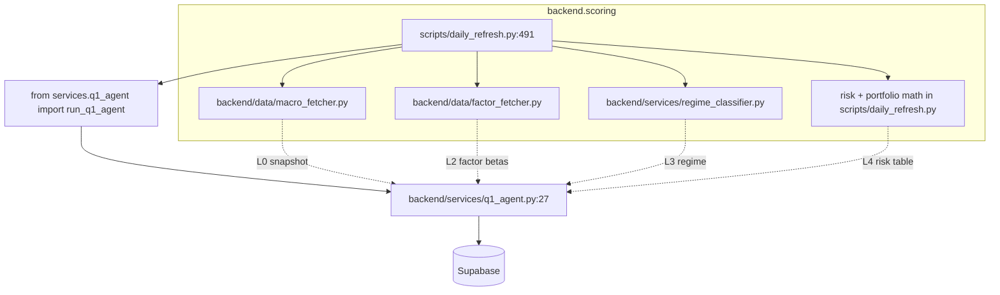

# Daily refresh import graph

Summary: the canonical Q1 import chain in `scripts/daily_refresh.py` is
`services.q1_agent.run_q1_agent`. The `backend.agents.research_agent` module
exists on disk but is NOT imported by `daily_refresh.py`; it is imported only by
`backend/services/q1_agent.py` (an internal shim), making the live Q1 chain
correctly fixed on `services.q1_agent`.

## Cited grep

Command:

```
git grep -nE "from backend\.services\.q1_agent|from backend\.agents\.research_agent|from services\.q1_agent" -- scripts/ backend/
```

Literal output:

```
backend/agents/research_agent.py:13:    from backend.agents.research_agent import ResearchState, run_research_pipeline
backend/services/q1_agent.py:27:    from services.q1_agent import run_q1_agent
scripts/daily_refresh.py:491:        from services.q1_agent import run_q1_agent
```

Interpretation: each grep hit is a self-import or a small re-export, not a
distinct pipeline entry. The only callable Q1 entry from `daily_refresh.py` is
`run_q1_agent` exposed by `backend/services/q1_agent.py:27`.


