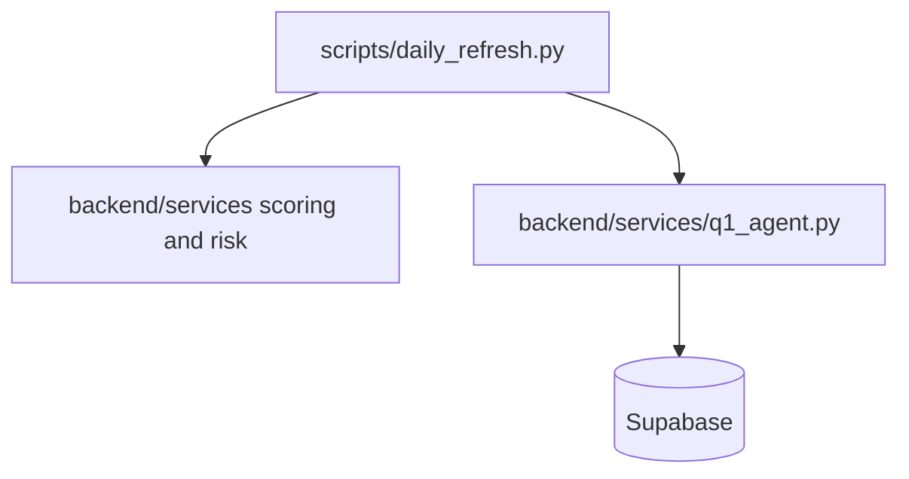

# Daily refresh import graph

Verified: `scripts/daily_refresh.py` lazily imports `from services.q1_agent import run_q1_agent` (line 491); no `backend.agents.research_agent` import exists.

```mermaid
graph TD
 daily_refresh[scripts/daily_refresh.py] --> scoring[backend/services scoring and risk]
 daily_refresh --> q1[backend/services/q1_agent.py]
 q1 --> supabase[(Supabase)]
```
