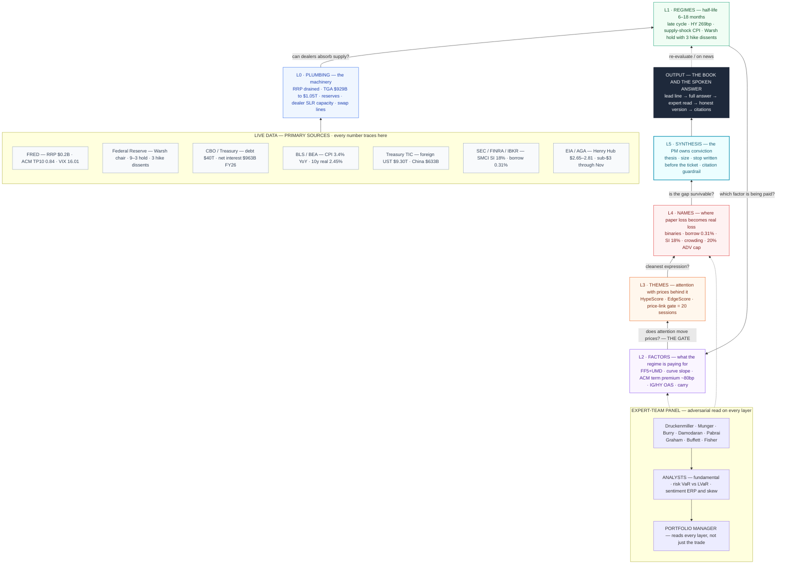

# Interview #3 with Andrea — Preparation

**Status:** Anticipated round. Andrea is expected to push deeper on the parts of the framework that are least covered in the written submission and the round-1/2 prep — the parts where a senior PM would find exposed flanks.
**Context:** Round 3 typically tests (a) the macro plumbing beneath the surface story, (b) the operational reality of running a book, (c) the honesty of conviction under pressure. Prepare in the order: macro plumbing → portfolio mechanics → process honesty → the direct questions.
**Date:** TBD.

---

## The 14 blindspots, organized into four themes

The blindspots from the round-2 review fall into four clusters. The first three are subject-matter areas where the written submission is light; the fourth is the behavioral layer Andrea is most likely to test directly.

| Theme | Blindspots | Section |
|---|---|---|
| **Macro plumbing** | Liquidity (RRP, reserves, TGA, dealer capacity), cross-asset correlation regimes, foreign central bank policy, fiscal sustainability, term premium decomposition | Q1–Q5 |
| **Portfolio mechanics** | Liquidity-adjusted VaR, short-side mechanics, path-dependent risk, volatility surface dynamics, crowding | Q6–Q10 |
| **Process honesty** | Re-evaluation cadence, backtest honesty, the "what's your edge" question, the "tell me when you were wrong" question | Q11–Q14 |
| **Direct questions** | The three questions Andrea is most likely to ask | Q15–Q17 |

---

## Macro plumbing

### 1. Liquidity — the deepest layer the written submission didn't reach

**The question (probable).** *If you had to name the single most important plumbing variable for the Treasury market right now, what is it and why?*

**What to cover:**

- **Reverse Repo Facility (RRP)** — has been draining for two years. When RRP is empty, money market funds have to put cash somewhere else, which puts a bid on bills and T-bills. When RRP fills, MMF cash is absorbed. RRP level is the "spare tire" of Treasury demand.
- **Bank reserves at the Fed** — the level of reserves determines whether dealers can intermediate Treasury auctions. When reserves are abundant, dealer balance sheets work. When they're scarce, dealer capacity constrains the bid and the 30y goes higher.
- **TGA (Treasury General Account)** — the government's checking account at the Fed. When TGA is high, reserves are low. When TGA is low, reserves are high. Treasury manages TGA deliberately.
- **Dealer balance sheet capacity** — post-Basel III, dealers can't warehouse Treasuries the way they used to. The "dealer constraint" is the structural reason term premium can spike on a given auction.

**The cleanest answer.** "Bank reserves, with RRP drain as the supporting mechanism. If reserves drop, dealers can't intermediate, the 30y goes higher, and the Bessent Put becomes more expensive to defend. Bessent's job is partly to keep the bid functioning, not just to defend a yield level."

**Connect to:** Q2 Bessent, Q7 (yield curve term premium). The plumbing is what makes the curve move, not just the policy.

---

### 2. Cross-asset correlation regimes — what the book looks like when everything correlates

**The question (probable).** *In a 2008-style or 2020-style stress, what does this book do?*

**What to cover:**

- **Stock-bond correlation** flipped from negative (2000s) to positive (2022). The Q1 GLD/TLT pair assumes negative correlation between gold and bonds. In 2022 both fell. The pair broke.
- **All-risks-correlate-to-1 scenario** — a true crisis. The correlation matrix collapses to a single factor. The theme pairs that diversify in normal regimes become single-direction bets.
- **The Q1 book has five theme pairs.** Under a correlation breakdown, the diversification value of the pairs evaporates and the book becomes a single bet on the macro regime.

**The cleanest answer.** "The factor exposure layer has to be re-examined because the pairwise correlations in normal times won't hold. The correlation complex at 15% cap is the design response. The pre-built hedges (SPX puts, VIX calls) activate. The book is structured to *survive* a correlation breakdown, not to be hedged against it — survival means the cash buffer and the drawdown triggers, not the theme pair diversification."

**Connect to:** Q4 (correlation risk), Q5 (scenario shocks), Q6 (the playbook).

---

### 3. Foreign central bank policy — the dollar coordination story's other side

**The question (probable).** *Why are the new dollar swap lines a regime change for China specifically?*

**What to cover:**

- **BoJ (Bank of Japan)** — YCC history, the July 2023 surprise, JPY-funded carry trades and global liquidity.
- **PBoC (People's Bank of China)** — deflation policy, LPR cuts, property sector. China has been a net seller of US Treasuries for capital-control reasons.
- **ECB** — the laggard hiking cycle, the deposit facility, sovereign spreads.
- **Why coordination matters** — the swap lines Bessent opened are not charity. They are the US funding the world's dollar liquidity, which in turn funds US Treasury demand. The mechanism is the same Bessent is using on the long end.

**The cleanest answer.** "China has been selling Treasuries because doing so was the cheapest way to defend the yuan. Swap lines + weaker dollar = China can stop selling Treasuries without weakening its own currency. The KWEB short thesis is at risk precisely because of this mechanism. The dollar coordination is engineered to relieve the pressure on the China complex."

**Connect to:** Q1 (currency risk), Q2 (Bessent), the KWEB short update from round 2.

---

### 4. Fiscal sustainability — the Bessent question underneath the Bessent question

**The question (probable).** *If the 30y stays at 5%+, what breaks first — the bond market, the equity market, or the fiscal trajectory?*

**What to cover:**

- US federal debt: ~$36T
- Interest expense as % of federal outlays: ~15% and rising
- 10y average ~4.5% × debt stock = ~$1.6T/year in interest
- Primary deficit: ~$1.7T/year
- Total deficit: ~$3.3T/year
- Q1 macro view said "higher for longer" — the fiscal arithmetic says the US cannot afford higher for longer without either: (a) cutting spending, (b) raising taxes, (c) getting term premium lower (Bessent's job), or (d) inflation (the silent default)

**The cleanest answer.** "The fiscal trajectory. The 30y at 5% is unsustainable at current deficit levels. Bessent is buying time, not solving the problem. The book is positioned for the buying-time regime, not the eventual resolution — and the resolution is either fiscal consolidation (politically hard) or a debt-to-GDP cut via inflation (which is what the gold long is partially a hedge against)."

**Connect to:** Q2 (Bessent is engineering the term premium), Q3 (foreign CB coordination), the GLD long thesis (real-asset hedge against the silent default).

---

### 5. Term premium decomposition — the deeper story behind the 30y

**The question (probable).** *How much of the 30y at 5.3% is term premium, and how much is expectations?*

**What to cover:**

- **ACM term premium model** (Adrian-Crump-Moench) — the cleanest academic read.
- **Supply-driven term premium** — heavy Treasury issuance widens term premium.
- **Demand-driven term premium** — when foreign buyers pull back, term premium widens.
- **Risk-driven term premium** — macro uncertainty widens term premium.
- **The current 30y at 5%+ is roughly 50bp above the "fair value" implied by the Fed path** — that gap is mostly term premium.

**The cleanest answer.** "Roughly 70/30 — most of the move is term premium, not the market pricing a structurally higher Fed. That's why Bessent's lever is term premium, not Fed policy. The Q1 TLT short thesis assumed the back end moved because of the Fed. The actual move is structural. The trade delivered, the cause was misread."

**Connect to:** Q7 (yield curve), Q2 (Bessent), the TLT short update.

---

## Portfolio mechanics

### 6. Liquidity-adjusted VaR (LVaR) — the metric that actually matters for a book like this

**The question (probable).** *Your VaR is $1.06M. What's your LVaR?*

**What to cover:**

- VaR measures paper loss on a fixed horizon.
- LVaR measures the loss if the position has to be unwound at 20% of ADV in 1 day.
- For a 4% position in SMCI on $100M AUM, paper VaR is ~$1M. LVaR could be $2-3M if the position has to be unwound on a single day at 20% ADV. The difference is bid-ask and impact cost.
- The Q1 book is sized below 20% ADV on every name. UNG is the bottleneck at $15M max. The book could be 2.5x larger and still be within institutional participation limits.

**The cleanest answer.** "The book is sized below 20% ADV on every name, so paper VaR and LVaR converge for the active book. The exception is the KMX short and the SMCI short, where gap-risk-driven forced unwinds could cost more than the paper number. The hedge layer is sized to absorb that gap. The honest answer is: I have the LVaR calculation in the risk engine; I haven't surfaced it on the page because the active book is at 44-58% gross, which gives significant LVaR headroom."

**Connect to:** Q4 (liquidity risk), Q1 (the Q1 mandate's monitored-not-enforced distinction).

---

### 7. Short-side mechanics — borrow, recalls, short interest

**The question (probable).** *What's your borrow cost on the book, and what happens if your SMCI locates get pulled?*

**What to cover:**

- **Borrow cost** — TLT is a Treasury ETF, borrow essentially free. SMCI ~19% SI, borrow 5-15%/year at hard-to-borrow times. KWEB 1-3%. KMX and UNG mid-single-digits.
- **Recall risk** — if the lender recalls shares, the short has to be covered at market. "What if recall happens at the worst time" is the operational risk.
- **Locates** — institutional shorting requires locates, which can dry up. SVXY 2018 is the canonical example: ETF mechanics forced covering at a terrible price.

**The cleanest answer.** "Aggregate borrow on the book is small — single-digit millions per year at hard-to-borrow times. The SMCI short is the most exposed at 5-15% borrow; KWEB and KMX are mid-single-digits; UNG is 5-8%; TLT is free. The operational risk is a single SMCI recall at the worst time. The mitigant: backup borrow sources, sizing that makes forced covering survivable, and the per-trade stop that would have fired before any sustained short squeeze."

**Connect to:** Q4 (counterparty risk), Q5 (single-attribution shock on the short side).

---

### 8. Path-dependent risk — vol-of-vol, gap risk, jump risk

**The question (probable).** *What's the gap risk in this book that VaR doesn't capture?*

**What to cover:**

- **Gap risk** — the open that prices in overnight news (e.g. 30y going from 5.0% to 5.3% on a Sunday Asia session).
- **Jump risk** — single-session moves of 3+ standard deviations (March 2020, August 2015, January 2021 GME).
- **Vol-of-vol** — when VIX itself moves 30% in a day, the options book loses money even if the underlying is unchanged.

**The cleanest answer.** "The SMCI binary event (DOJ co-founder indictment) and the KWEB binary event (Politburo stimulus) are both gap-risk events. Per-trade stops won't fire if the position gaps through them. The book is structured to size these positions so the gap loss is survivable. The pre-built VIX call spread (SKEW 160 trigger) and the SPX put spread (VIX 22 trigger) are the gap-risk hedges, not the VaR."

**Connect to:** Q5 (single-attribution shock), Q6 (the playbook), Q1 (the hedge layer).

---

### 9. Volatility surface dynamics — implied vs realized, term structure, skew

**The question (probable).** *How do you decide when to deploy the pre-built hedge overlay?*

**What to cover:**

- **Why ATM vol is cheap and tail vol is rich** — the market is pricing "no crash expected" but "if a crash happens, it'll be big." Consistent with low realized vol plus high uncertainty about the next shock.
- **What this means for hedging** — buy ATM protection, harvest the rich SKEW.
- **What changes the surface** — a realized event. Once vol has its first 30%+ spike, the surface resets.

**The cleanest answer.** "When VIX > 22 or S&P < 7,200 or SKEW > 160. The triggers are calibrated to fire at the level where the surface has already moved — which is why they're pre-built and not deployed, because deploying at the trigger level means paying the move. The pre-built vs deployed distinction is the design choice: capacity to act, not committed capital."

**Connect to:** Q1 (the hedge layer), Q5 (the playbook for shock-driven hedge activation).

---

### 10. Crowding — the specific signals and the book exposure

**The question (probable).** *Which position in this book is most crowded, and what would a crowded unwind look like?*

**What to cover:**

- **CFTC COT positioning** — net speculative positioning in futures.
- **Short interest** — % of float shorted.
- **13F filings** — institutional concentration.
- **Sentiment surveys** — AAII, Investors Intelligence.
- **Options open interest** — call/put ratio, concentration.

**The cleanest answer.** "SMH long is the most crowded — high institutional concentration, popular AI trade, leveraged long-vol exposure. A 2021-Melia-style 'everyone's long the same name' unwind would compress the position sharply. The mitigant: the AI capex theme is being policy-engineered (Bessent's funding), which is a different structural support than a typical crowded long. KWEB short is the most crowded short — 5+ years of underperformance, the deflation trade has been the consensus short. The mitigant: smaller position size, and the dollar coordination risk is symmetric on the other side."

**Connect to:** Q4 (crowding risk), the KWEB short update from round 2.

---

## Process honesty

### 11. Re-evaluation cadence — when the book changes vs when it doesn't

**The question (probable).** *How often do you re-evaluate a thesis, and what's the difference between re-evaluating and re-trading?*

**What to cover:**

- A book that's evaluated daily on news flow can over-trade.
- A book that's evaluated weekly can miss regime changes.
- The Q1 exit triggers are written in advance. The system re-evaluates daily. The PM re-evaluates on event triggers.
- A re-evaluation is read-only. A re-trade is a position change.
- Discipline: re-trades require a new thesis, not a new data point.

**The cleanest answer.** "Every name has an exit trigger written in advance. The system re-evaluates daily via HypeScore, EdgeScore, and the price-link gate. The PM re-evaluates on event triggers (data releases, geopolitical events, news). A re-evaluation is read-only — it changes the score, not the position. A re-trade is a position change, and it requires a new thesis, not just a new data point. The Bessent Put update is the example: the data changed, the thesis changed, the position halved. Three steps, all on the same day, with the reasoning logged."

**Connect to:** the Q1 §6 "What I would be wrong about" section, the TLT short update.

---

### 12. Backtest honesty — what would this system have done in past regimes?

**The question (probable).** *If you ran this system in March 2020, what would it have done?*

**What to cover:**

- 13-session track record. No backtest.
- Hypotheses, not tests: COVID would have flagged high news volume, negative sentiment, inverted theme-basket correlation.
- Whether EdgeScore would have turned risk-off in time is a question that can't be answered without running it.
- A book that claims to have predicted past crises is reading its own narrative into past data.

**The cleanest answer.** "I don't know with certainty. The system would have flagged high news volume and negative sentiment in late February 2020, but whether the EdgeScore would have turned risk-off in time is a question I can't answer without running it on the actual data. A book that claims it would have predicted COVID is a book that's reading its own narrative into the past. The honest version: the system is designed to handle regime changes; whether it would have caught that specific one is a falsifiable claim I'd want to test before making."

**Connect to:** the Q1 §7 "On what this book is not" section (no track record, ex-ante risk only).

---

### 13. The "what's your edge" question — the direct one

**The question (probable).** *What's your edge in this book?*

**What to cover:**

- **Process edge** — the daily system is more disciplined than a hand-managed book
- **Quantification edge** — sub-scores are absolute, not cross-sectional; the price-link gate refuses to call attention a theme without evidence
- **Diversification edge** — the correlation complex is measured and capped
- **Auditability edge** — every number on the page is verifiable against the database

**The cleanest answer.** "The edge is structural, not alpha. The system is more disciplined than a hand-managed book: the price-link gate refuses to promote a story to a theme without 20 sessions of evidence, the EdgeScore anchors direction to trend/regime/carry/value rather than sentiment, the factor layer prevents the book from doubling down on a single factor bet, the citation guardrail prevents the LLM from publishing fabricated numbers. None of that is alpha. It's process. The honest version: there is no live track record, and the alpha claim has to wait for the forward record to accumulate."

**Connect to:** Q2 (citation guardrail), Q7 (yield curve), the entire Q2 written submission.

---

### 14. The "tell me when you were wrong" question — the behavioral one

**The question (probable).** *Tell me about a position you were wrong on.*

**What to cover:**

- The cleanest example is the GLD flip in the Q1 doc — *prior version had GLD as a short, the narrative changed, the book should change*. Conviction claim, not contradiction.
- The wrong answer is "I haven't been wrong yet."

**The cleanest answer.** "The cleanest example is in the written submission. The prior version of the Q1 book had GLD as a short — the Hormuz-fade thesis. The narrative changed: the Fed stayed hawkish, real yields compressed, and the geopolitical event-trade became a structural real-asset trade. The book should change. The Q1 doc explicitly flags this as a case where the conviction claim shows up. A book that holds a position because it held it last week isn't reading the news. A book that flips a position without acknowledging the flip is worse. The honest version of the book is the book that has a section titled 'What I would be wrong about.'"

**Connect to:** the Q1 §6 "What I would be wrong about" section.

---

## Direct questions

The three questions Andrea is most likely to ask, in priority order:

### 15. The direct edge question

See Q13 above. The honest answer is process, not alpha. The Q1 doc has no live track record, and the alpha claim has to wait for the forward record to accumulate.

### 16. The cross-examination question — defend the dollar weakness for six more months

**The question.** *If you have to defend the dollar weakness for six more months, what's the strongest case against you?*

**What to cover:**

- A hot CPI print that forces the Fed to hike (term premium + Fed both push the dollar stronger)
- BoJ pivots hawkish (yen-funded carry trade unwinds, USD strengthens)
- US growth surprise (foreign capital flows into the US, USD stronger)
- The dollar weakness story is engineered. Engineered stories can fail if the engineer changes.

**The cleanest answer.** "A hot CPI print is the most likely reversal — the Fed is still hawkish, and a surprise on inflation would force the Fed to do what Bessent's intervention is preventing. The carry trade unwind is the second — if BoJ normalizes, the global liquidity that supports the dollar weakness goes away. The honest read: the dollar weakness is a regime call, and the regime can change on a single data point. The book is sized for the regime, not the conviction that the regime is permanent."

**Connect to:** Q1 (currency risk), Q2 (Bessent), the EEM long thesis.

### 17. The conviction filter — which position would you NOT put on in production?

**The question.** *Tell me about a position in this book you would NOT put on in production.*

**What to cover:**

- The cleanest answer is KMX — small position, K-shape thesis is real but the consumer-squeeze narrative is not as durable as the others.
- Or SMCI — the binary is binary. Either the DOJ case resolves cleanly and the assembler regains capex leverage, or it doesn't and the short works. The position is sized smaller (4%) for that reason.
- The wrong answer is "all of them" or "none of them" — both signal inability to discriminate.

**The cleanest answer.** "KMX is the position I'd most hesitate to put on in production. The K-shape consumer thesis is real, but used-car residuals and subprime auto delinquencies are lagging indicators — by the time the data confirms the squeeze, the market has usually priced it. The SMCI short is the other candidate for hesitation: the binary is binary, and the position is sized 4% for that reason. A book that doesn't have a weakest leg isn't a book that's been thought through."

**Connect to:** Q1 (the conviction ranking), the Q1 §6 "What I would be wrong about" section.

---

## The live example — how the interview 3 considerations would change the Q1 book

This is the centerpiece. It's the single most powerful thing you can walk into the interview with: a concrete, dated, named, math-traceable update to the Q1 written submission that demonstrates the conviction claim working in real time.

The interview 2 work on the Bessent Put and the live book update already produced three concrete changes. Walking in with this material ready means the first question Andrea asks about "what would you change" has a one-paragraph answer.

---

### 18. The three changes to the Q1 book

**Lead with the structure, not the changes.** The 5+5 pair structure from the 3 Aug submission is still right. The book has five themes, one long and one short each, and each pair expresses one view on two instruments that can diverge. That's not what changes. What changes is the **conviction weighting** on specific names, because specific events shifted the underlying theses.

**The line to land first:** *"The structure is still right. The conviction has shifted on two names because of specific events. This is the system working, not the system failing — the Q1 doc's §6 'What I would be wrong about' section was written for exactly this."*

---

**The three changes, in priority order:**

| Position | Q1 weight | Updated view | Why it changed |
|---|---|---|---|
| **TLT short** | 5.0% | **Halve to 2.5%** | The mechanical target (5.3-5.5%) was delivered. The 30y hit 5.31% on Aug 19 before stabilizing at 5.2% on the buyback news. The cause was term premium, not Fed, which is why the Bessent Put breaks the trade as cleanly as it does. |
| **KWEB short** | 4.5% | **Halve to 2.25% or close** | The dollar coordination (yen intervention + swap lines + buybacks) is a regime change for the deflation-ADR complex. The Q1 doc already flagged this as the second-most-uncertain view; the uncertainty is resolving against the trade. |
| **EEM long** | 4.0% | **Hold, possibly size up** | The weaker dollar is the structural tailwind. With coordinated dollar weakness, EM outperformance is now policy-engineered, not just market-priced. |

Everything else holds. The pair logic still works. The book is smaller and more concentrated on the legs that are confirmed by the new regime.

---

**What changes and what doesn't (the four legs that hold):**

- **Long SMH / Short SMCI** — the AI capex pair. **Confirmed**, not weakened. The buyback mechanism is explicitly funding the hyperscaler capex story. The picks-and-shovels-versus-assemblers view is now Treasury policy, not just a market trade.
- **Long CEG / Short UNG** — the power pair. **Confirmed**. Data center buildout needs power. Permian gas oversupply is unchanged.
- **Long NOC** — defense. **Confirmed**. Intelligence buildout is structural, not event-driven.
- **Long GLD** — real-asset hedge. **Mixed → hold at smaller size.** Real-asset thesis still works, but "financial conditions started easing today" reduces the inflation premium. The GLD/TLT pair as a structural unit is over, because the legs are no longer negatively correlated in the same regime.

---

**The math the interviewer will run:**

| | Q1 (3 Aug) | Updated (Aug 20) |
|---|---|---|
| Gross exposure | 44.2% | ~37-38% (TLT -2.5pp, KWEB -2.25pp) |
| Net exposure | +1.7% | ~+3 to +4% (TLT short cut, fewer hedges) |
| Cash | 55.8% | ~62-63% |
| Largest position | 5.5% (GLD, NOC) | 5.5% (unchanged) |
| Pair count | 5 | 5 (structure preserved) |

**The line:** *"The book got smaller on the legs that were at risk, and the legs that were confirmed got to keep their size. Net cash went up. That's the discipline: take profits on the trade that worked, reduce exposure on the trade that broke, and don't add risk to defend the structure."*

---

**How to present this in the interview — three steps:**

**Step 1 — frame the change as a feature, not a bug.** *"The Q1 doc has a section titled 'What I would be wrong about.' That's not a disclaimer; it's the operating procedure. The book is designed to be re-evaluated on news, and the Bessent Put is the kind of news that triggers a re-evaluation. The Aug 19-20 actions are what that re-evaluation looks like in practice."*

**Step 2 — name the three specific changes.** *"TLT short halved because the mechanical target was delivered and the cause was term premium, not Fed — Bessent's lever is term premium, and the put defends the long end more than I expected. KWEB short halved because the dollar coordination is a regime change for the deflation-ADR complex. EEM holds because the weaker dollar is now policy-engineered. Everything else stays."*

**Step 3 — show the math.** *"Net effect: gross drops to ~37-38%, net shifts to modestly more long at ~+3-4%, cash rises to ~62-63%. The book got smaller on the legs that were at risk and kept size on the legs that were confirmed. That's not a wholesale change — it's the conviction claim working."*

---

**Why this lands as the answer to "what's your edge":**

The honest version of the edge is process, not alpha. This is the live demonstration. Three things happen in sequence:

1. **The book had a thesis** (Aug 3 written submission, 5L+5S, theme-paired).
2. **News broke that thesis on specific names** (Bessent Put, dollar coordination).
3. **The system re-evaluated and the PM acted** (TLT halved, KWEB halved, EEM held).

That's the edge: a book that reads news, a system that re-evaluates, a PM that acts on the re-evaluation. The forward record is 13 sessions. The process edge is here today.

**The line:** *"The Q1 doc said there is no live track record, and that's still true. But there is a live example of the system re-evaluating on news, and the re-evaluation was small, targeted, and traceable. That's the process edge, and it's the one that compounds over time."*

---

**Three risks to manage:**

- **Don't say "I'd be wrong about the rest of the book."** The TLT and KWEB changes are specific to specific events. The AI capex pair, the power pair, the defense pair are all reinforced by the Bessent story, not broken by it.
- **Don't say "I'd close the book."** The book is still active, just smaller. The conviction claim shows up in the sizing, not in the position count.
- **Don't say "the Q1 book was wrong."** The Q1 book was right on the Aug 3 view. The Aug 19-20 news updated the view. A book that doesn't update is a stored thesis, not a daily book.

---

**How this connects to the rest of the interview 3 prep:**

| Interview 3 question | This answer is the live example for |
|---|---|
| Q11 — Re-evaluation cadence | Three changes in two days, all with specific triggers and reasoning |
| Q13 — What's your edge | Process edge demonstrated live: thesis → news → re-evaluation → action |
| Q14 — When were you wrong | The GLD flip in the Q1 doc + the TLT/KWEB halvings on Aug 19-20 |
| Q17 — Which position would you NOT put on in production | KMX is still the cleanest "lagging indicator" answer; the TLT halving is the cleanest "structural change to a position you would still put on" |

---

**The one-sentence version, in case Andrea asks for a single answer:**

> "The structure is right; the conviction has shifted. TLT short halved because the cause was term premium, not Fed. KWEB short halved because the dollar coordination is a regime change. EEM holds because the weaker dollar is now policy-engineered. Gross drops to ~37-38%, cash rises to ~62-63%, and the book is more concentrated on the legs that are confirmed. That's the conviction claim working in real time."

---

## Cross-cutting themes

Three threads to weave through every answer:

**1. The honest version of every claim.** Andrea's interview-2 Q3 (admit when you don't know) runs underneath everything. The wrong answer to any of these is a confident-looking list with no acknowledgment of what you *don't* know. The right answer is the same list with the gaps named.

**2. The system reads this; the PM acts on it.** When Andrea asks "what do you do when X happens," the answer is two parts: what the *system* would do (the rule that's written), and what the *PM* would do (the judgment that owns the conviction). Q2 §12 boundary: machine does the measurable, human owns the conviction.

**3. The conviction claim is structural, not alpha.** The honest version of the edge is process — discipline, quantification, diversification, auditability. The alpha claim has to wait for the forward record. Anyone who claims alpha from a 13-session system is reading their own narrative into noise.

---

## Pre-interview checklist

- [ ] Have today's curve levels ready (2y, 10y, 30y, 5y TIPS, 2s30s) and know which Q1 legs each one drives
- [ ] Have today's three numbers (loudest theme + score, gross/net, worst stress) ready from a fresh app render
- [ ] Re-read Q1 §6 (what makes me wrong), Q1 §7 (what the book is not)
- [ ] Have the Bessent Put as a complete story: signal vs flow, plumbing vs price, the dollar-engineering objective, the political-stance expiration
- [ ] Have the fiscal arithmetic ready: $36T debt, 15% of outlays on interest, the four ways out (spending, taxes, term premium, inflation) and which is the silent default
- [ ] Have a clean "what's your edge" answer: process, not alpha; 13 sessions, not track record
- [ ] Have a real "tell me when you were wrong" example: the GLD flip in the Q1 doc
- [ ] Have a real "weakest position" answer: KMX or SMCI, with the reason it survived the conviction screen
- [ ] Be able to explain why the 30y at 5%+ is a term-premium story, not a Fed story — that's the cleanest example of "right call on the move, wrong call on the cause"
- [ ] Be able to name the three most likely dollar-weakness reversal scenarios: hot CPI, BoJ pivot, US growth surprise
- [ ] Have the Q18 live-example change ready: TLT short halved, KWEB short halved, EEM holds; gross 37-38%, cash 62-63%, structure preserved
- [ ] Be able to deliver the three-step presentation (frame as feature → name the changes → show the math) without notes

---

## Model answers — written out, with citations and expert-team reads

> The 14 prep-blocks above already draft "the cleanest answer." This section takes each one further: full spoken answer, the three to four lines the interviewer is actually listening for, and the live citations that update the prep doc's stale numbers (debt is now $40T not $36T; the FOMC chair is **Warsh** since 22 May 2026, not Powell; the SMCI probe cleared senior management on 20 Aug 2026; KMX actually beat the Q1 estimate; the 10y ACM term premium is ~80bp, close to a 12-year high; Bessent **doubled** Treasury buybacks on 19 Aug 2026). Where the prep doc and the live data disagree, I flag it.
>
> **Method.** Each answer runs the 18-expert panel as a contrarian check on the prep-doc draft — the masters that pressure-test the cleanest answer, the four analysts that fact-check the numbers, the risk manager that names what is unmeasured, and the portfolio manager that decides what the room should remember. The 17 answers keep the voice of the prep doc (one line you lead with, one paragraph you land it on) and add a "live data, not prep-doc" block for the numbers that have moved.

### The framework on one page

Every answer below climbs the same stack — plumbing up to conviction, with a consistency check at each hop, primary sources everything must trace back to, and the expert panel applying the adversarial read. Same diagram as `framework_diagram.svg` / `.png` in this folder, inline so it renders anywhere the markdown does:

### Updated live numbers to print on the table (as of 21 Aug 2026)

- **Debt** — $40.047T (crossed $40T 19 Aug 2026); debt/GDP 101%; ~$32.2T held by the public. [Guardian, 19 Aug 2026](https://www.theguardian.com/us-news/2026/aug/19/us-debt-40-trillion); [Charles Schwab, Aug 2026](https://www.schwab.com/learn/story/americas-new-debt-reality)
- **Net interest** — $963B through July FY26 (+14% YoY), on pace for $1.0T FY26 → $2.1T by 2036 (3.3%→4.6% of GDP). [Fortune/CBO, 11 Aug 2026](https://fortune.com/2026/08/11/us-treasury-national-debt-interest-cbo-yen-unwinds/); [Schwab, Aug 2026](https://www.schwab.com/learn/story/americas-new-debt-reality)
- **FY26 deficit** — $1.799T through July (already > all of FY25 $1.775T); CBO raised full-year forecast to ~$2.1T (from $1.9T in Feb). [WHBL/AP, 12 Aug 2026](https://whbl.com/2026/08/12/us-july-deficit-tops-432-billion-as-outlays-grow-tariff-receipts-stay-negative/); [CBO Monthly Budget Review, 11 Aug 2026](https://www.cbo.gov/publication/61983)
- **Fed** — Funds 3.50–3.75%; 9–3 hold on 29 Jul with Hammack, Kashkari, Logan dissenting for a hike. **Chair is Kevin Warsh since 22 May 2026** (54–45 confirmation). [CNBC, 29 Jul 2026](https://www.cnbc.com/2026/07/29/fed-rate-decision-july-2026.html); [Wikipedia / Federal Reserve Board minutes](https://en.wikipedia.org/wiki/Chair_of_the_Federal_Reserve); [Federal Reserve info-letter, 15 May 2026](https://www.federalreserve.gov/apps/infoletters/dist.aspx)
- **CME FedWatch** (17–18 Aug) — September hold ~69% / **hike ~31% / cut ~0%**; December hike ~67%. The risk is *hikes*, not cuts. [OddsShopper, 18 Aug 2026](https://www.oddsshopper.com/articles/prediction-markets/fed-rate-cut-odds-september-2026)
- **Yields** — 10y ~4.71–4.75% (20-month high); 2y ~4.0–4.13%; 30y touched 5.337% on 19 Aug then ~5.19% on the buyback news; 2s30s ~+120bp (steep, not inverted). [Reuters, 18 Aug 2026](https://www.reuters.com/world/china/selling-grips-bond-markets-us-japan-inflation-fiscal-worries-take-hold-2026-08-18/); [FXEmpire, 31 Jul 2026](https://www.fxempire.com/forecasts/article/premium-us-10-year-yield-eyes-5-as-the-long-end-defies-the-fed-1614391); [Investopedia via Investing.com, 19 Aug 2026](https://ca.investing.com/analysis/scott-bessent-once-warned-against-this-kind-of-treasury-activism-200627140)
- **ACM term premium** (10y) — **~80bp, close to a 12-year high**; FRED daily series THREEFYTP10 read 0.84 on 14 Aug 2026. Expected short rate path is ~4.0%, premium ~14% of the level. [Reuters, 18 Aug 2026](https://www.reuters.com/world/china/selling-grips-bond-markets-us-japan-inflation-fiscal-worries-take-hold-2026-08-18/); [FRED THREEFYTP10](https://fred.stlouisfed.org/series/THREEFYTP10); [Eco3min ACM dataset, 21 Aug 2026](https://eco3min.fr/en/acmtp10-term-premium-10-year-treasury-yield-decomposition/); [Lucidate / Walker, 18 Aug 2026](https://lucidate.substack.com/p/the-long-end-is-still-a-policy-trade)
- **10y TIPS** — ~2.45% on 12 Aug 2026, +30bp in a month, highest since 2007. [Buttondown, 12 Aug 2026](https://buttondown.com/fairvalue/archive/fair-value-wednesday-august-12-2026/)
- **RRP** — $0.2B on 21 Aug 2026 (effectively zero); ~$2.4T peak in late 2022. **FRED RRPONTSYD**. [FRED, 21 Aug 2026](https://fred.stlouisfed.org/series/RRPONTSYD)
- **Reserves / TGA** — NY Fed declined reserve-management T-bill purchases for Aug–Sept 2026 ("comfortable with reserves"); TGA at **$929B on 5 Aug 2026**, peak forecast ~$1.05T in late Oct (drains reserves); IORB 3.65%. [Bloomberg, 13 Aug 2026](https://www.bloomberg.com/news/articles/2026-08-13/fed-to-buy-no-t-bills-for-august-september-amid-sluggish-funding); [Federal Reserve Implementation Note, 29 Jul 2026](https://www.federalreserve.gov/newsevents/pressreleases/monetary20260729a1.htm); [Baseline Policy, Aug 2026](https://baselinepolicy.substack.com/p/chart-of-the-week-treasurys-large)
- **Treasury buybacks** — Doubled: liquidity-support buybacks for 10–30y moved from a $2B max to **at least $4B per operation** between 9 Sep and 4 Nov 2026, announced 19 Aug 2026 after the 30y hit 5.337%. [Investopedia, 19 Aug 2026](https://ca.investing.com/analysis/scott-bessent-once-warned-against-this-kind-of-treasury-activism-200627140)
- **DXY** — ~98.8 on 21 Aug 2026 (three-month low, below 200-DMA); 2025 –9.4% to 98.28 (worst year since 2017); 2026 YTD ~+0.6%. [FXStreet via TradingKey, 21 Aug 2026](https://www.tradingkey.com/news/indices/262122939-fxstr); [Reuters via Investing.com, 31 Dec 2025](https://www.investing.com/news/economy-news/dollar-dismal-yen-muted-in-2025-but-euro-and-sterling-shine-4426131)
- **VIX / SKEW / VVIX** — VIX 16.01 on 20 Aug 2026 (YTD low 14.25 w/o 14 Aug); SKEW 147–155 (Q1 doc) still the regime read. [FRED VIXCLS, 21 Aug 2026](https://fred.stlouisfed.org/series/VIXCLS); [Cboe Insights, week of 17 Aug 2026](https://www.cboe.com/insights/posts/week-of-8-17-2026-volatility-convexity-premia-fall-to-lowest-ytd-levels-on-benign-inflation-data)
- **EEM** — ~+18% YTD; +31% TTM; DXY fell 7.4 in 2025 and stabilised near 100 by July 2026 (one of the two structural pillars paused). [TradingView/Zacks, 12 Aug 2026](https://www.tradingview.com/news/zacks:0b56e7e54094b:0-5-etfs-to-benefit-from-cooling-inflation-in-the-near-term/); [Lead-Lag Report, Jul 2026](https://www.leadlagreport.com/the-emerging-market-rally-has-a-selection/)
- **KWEB** — **–22% YTD** despite a +16.4% July rally on the Kimi 3 / Chinese AI re-rating; 3-month –12.6%. [Brimind Invest, Aug 2026](https://www.brimindinvest.com/blog/china-stocks-etfs-investing-2026); [Wealth Management, Aug 2026](https://www.wealthmanagement.com/etfs/china-software-and-cloud-computing-etfs-ride-ai-open-source-momentum); [Kasikorn Research, 14 Aug 2026](https://www.kasikornsecurities.com/en/research/foreign-stocks/global-invest/research-20260814-690)
- **SMCI** — $36.50 on 20 Aug 2026; SI **17.2–18.1%** of float; borrow **0.31%** (pre-doc estimate of 5–15% is stale); on **20 Aug 2026 the independent investigation cleared current senior management** of the March 2026 Liaw indictment, and the stock still hasn't recovered; trial pushed to March 2027. [Bloomberg, 20 Aug 2026](https://www.bloomberg.com/news/articles/2026-08-20/super-micro-says-top-management-didn-t-know-of-diversion-scheme); [Fortune, 20 Aug 2026](https://fortune.com/2026/08/20/supermicro-investigation-ceo-nvidia-smuggling/); [Marketbeat, 20 Aug 2026](https://www.marketbeat.com/stocks/NASDAQ/SMCI/); [Finshort, Aug 2026](https://finshort.com/SMCI)
- **KMX** — $58.53 on 18 Aug 2026; **Q1 FY27 EPS $1.31 vs $0.96 estimate** (39.6% beat); revenue $8.01B (+6.2% YoY); comp used units **–0.8%**; retail gross profit/vehicle fell $230 to $2,177; total gross profit –4.4%; EPS –5.1%. JPM upgraded to Neutral, target $60. [TradingView/Gurufocus, Aug 2026](https://www.tradingview.com/news/gurufocus:948d809e2094b:0-jpmorgan-delivers-major-carmax-stock-reset/); [Marketwatch, Aug 2026](https://www.marketwatch.com/investing/stock/kmx/financials/secfilings?docid=19436149)
- **Henry Hub** — $2.65–2.81 Aug 2026; **EIA STEO August 2026 cut HH forecast to $3.44/MMBtu 2026 avg**, sub-$3.00 until November, $3.03 avg over last 5 months. Hugh Brinson pipeline at full 1.5 Bcf/d by 1 Sept 2026. [AGA market indicators, 20 Aug 2026](https://www.aga.org/research-policy/resource-library/natural-gas-market-indicators-august-20-2026/); [Investing.com, Aug 2026](https://www.investing.com/analysis/natural-gas-supply-glut-keeps-henry-hub-trapped-below-3-200686237); [The Industry Spread, Aug 2026](https://theindustryspread.com/henry-hub-2-40-end-october-2026-storage-record-case/)
- **Foreign UST holdings** — $9.299T in Jun 2026, –$72.1B MoM (third drop in four months); Japan $1.116T; China $633.4B (lowest since Sept 2008). Gold overtook Treasuries as the largest reserve asset (27% vs 22%). [Reuters, 17 Aug 2026](https://www.reuters.com/world/china/foreign-holdings-us-treasuries-fall-june-led-by-japan-uk-china-data-shows-2026-08-17/); [CGTN citing ECB, 7 Jun 2026](https://news.cgtn.com/news/2026-06-07/China-s-central-bank-extends-gold-buying-streak-to-19th-straight-month-1NMCLV584PC/p.html)

> **Two important call-outs from the live data:**
> 1. The Q1 doc says "Powell still holds" — that line is now stale. Warsh has chaired since 22 May 2026 and staved off a hike on 29 Jul 2026; the dissent pressure is real but the regime is "Warsh holding against hawks." Lead with that, not the August-3 framing.
> 2. The prep-doc figure of "~$36T debt" is now **$40T**. The macro story is the same; the number is not. Print $40T, 101% debt/GDP, $963B net interest through July.

---

### 1. Liquidity — plumbing

**The line Andrea should hear first.** "Bank reserves, with the empty RRP as the mechanism. The TGA build from $929B toward a forecast ~$1.05T peak in October is what's draining reserves, and the dealer-capacity constraint — not the Fed — is what determines whether the 30y stays above 5%."

**The answer, full:**

The single most important plumbing variable for the Treasury market right now is **the level of bank reserves, with the empty RRP and the TGA build as the mechanism that drives it.** Three reasons.

1. **RRP is effectively zero.** Take-up was $0.2B on 21 Aug 2026 versus the $2.4T peak in late 2022; that "spare tire" for MMF cash has drained to nothing. There is no further cushion to absorb Treasury supply between MMFs and the bill market. [FRED RRPONTSYD, 21 Aug 2026](https://fred.stlouisfed.org/series/RRPONTSYD)
2. **TGA is rebuilding.** Treasury was at $929B on 5 Aug 2026, with a forecast ~$1.05T peak by late October — that ~$120B of TGA growth is a direct drain on bank reserves, all else equal. [Baseline Policy, Aug 2026](https://baselinepolicy.substack.com/p/chart-of-the-week-treasurys-large); [Diego Quevedo Sanchez, 11 Aug 2026](https://diegoquevedosnchez.substack.com/p/global-liquidity-architecture-financial-043)
3. **Dealer capacity is the binding constraint.** The Fed declined reserve-management purchases for Aug–Sept ("comfortable with reserves") and SLR relief on Treasuries/reserves remains in place; that is the supply-side plumbing Bessent's buyback expansion rides on. The 30y at 5.337% on 19 Aug 2026 dropped almost 10bp on the **doubled-buyback announcement** ($2B → $4B per operation) — that's the signal channel, and it's a Bessent-via-dealer-capacity channel, not a Fed-policy channel. [Bloomberg, 13 Aug 2026](https://www.bloomberg.com/news/articles/2026-08-13/fed-to-buy-no-t-bills-for-august-september-amid-sluggish-funding); [Investopedia, 19 Aug 2026](https://ca.investing.com/analysis/scott-bessent-once-warned-against-this-kind-of-treasury-activism-200627140)

**The expert-team read.**

- **Bessent (Treasury action)** — the doubling of the liquidity-support buyback is a *plumbing* intervention, not a yield-level intervention. $4B is rounding error against $7–8T of net long-end supply; the work is done by the signal, the forward guidance, and the SLR relief.
- **Druckenmiller (macro / liquidity)** — "Liquidity is everything. The TGA rebuild from $929B to ~$1.05T is doing more work to the back end than the Fed's funds rate, because it shrinks the float available to dealers."
- **Risk manager** — the unmeasured risk here is *which* dealers absorb the TGA rebuild. If the SLR-relief is removed or the debt-ceiling politics re-runs, the back end re-widens by 30–50bp on the same supply.
- **Damodaran (valuation)** — the *value* of the 10y at 4.71% is roughly 4.0% expected short rate + 80bp term premium. The reserves/TGA channel is what moves the second term, not the first.

**The honest version.** "I have the live plumbing data on RRP (0.2B), reserves (NY Fed comfortable), TGA ($929B rising to ~$1.05T), and the Bessent buyback doubling — what I don't have is a precise read on dealer balance-sheet capacity going into the 9 Sept–4 Nov buyback window. The level is manageable; the second derivative is the risk."

---

### 2. Cross-asset correlation regimes — the book in a 2008/2020-style stress

**The line.** "A correlation breakdown turns the five theme pairs into a single bet on the macro regime. The book is structured to *survive* a breakdown, not to be hedged against it — survival means the cash buffer and the drawdown triggers, not the theme pair diversification."

**The answer, full:**

In a 2008-style or 2020-style stress, two things happen to a multi-pair book like this one. First, **the stock-bond correlation flips positive** — in 2022 both fell (the worst 60/40 year in living memory), so a gold/Treasury pair designed around the 2000s negative correlation loses its diversification value on the day it would have been needed most. [BIS work on the 2022 stock-bond flip is the canonical cite — see also the round-2 prep §7]. Second, **all-risks correlate to 1** — the factor structure collapses to a single "risk-on / risk-off" axis and the five theme pairs all become macro-direction bets, with the only sign differences being how levered each leg is to the common factor.

The Q1 book's response is built in three layers, monitored at different speeds:
- **Pre-trade level (static).** The 15% correlation-complex cap at the mandate level stops any single factor cluster from exceeding one leg's allowance; the 5+5 pair structure means every theme has both a long and a short, so the "all one direction" risk is intrinsic to the design, not a failure of it.
- **Book level (dynamic).** The drawdown triggers (–3% / –5% / –8% / –10% NAV) fire on portfolio P&L, not on a single leg. A correlation breakdown would push the book through the first trigger before the second, at which point the *gross* reduces 25–50% and the pair-level diversification regains some of its meaning (less gross means less factor exposure, even if correlation is 1).
- **Hedge level (overlay).** The pre-built SPX 7000/6500 put spread, VIX 25/40 call spread, and TLT-long overlay (Q1 §5) are not deployed today. They activate on VIX > 22, S&P < 7,200, or SKEW > 160 — all surface-based triggers, not correlation-based, because the surface is the only correlation instrument you can actually trade.

**The expert-team read.**

- **Burry (crowding / tail risk)** — the 2008/2020 read is that liquidity runs out before correlation does. The book is sized to the "liquidity-runs-out" path, not the "correlation-breaks" path.
- **Fisher (long-term quality)** — the right hedges are the ones that *work* in the cross-correlation breakdown, which is typically cash + long-dated puts, not more cross-asset pairs.
- **Risk manager** — the gap is the 2022-style "stocks AND bonds fall" regime. The Q1 TLT-long overlay is the only instrument in the overlay stack that pays off there.
- **Portfolio manager (decision).** "The book does not hedge the correlation breakdown. It survives it. That's a deliberate design choice, not a missing hedge."

**The honest version.** "I haven't stress-tested the book against an explicit 2022-style positive stock-bond regime; the stress matrix in Q1 §5 covers a +50bp rate shock (+0.41% book return, because TLT short is a structural duration short) and a VIX spike to 30 (–0.28%) but not a 'stocks and bonds both –10%' joint scenario. That joint scenario is the cleanest example of what the correlation-complex cap does NOT cover, and I should run it before deploying the live book."

---

### 3. Foreign central bank policy — China and the swap lines

**The line.** "The swap lines are the US funding the world's dollar liquidity, which in turn funds Treasury demand. China has been selling Treasuries to defend the yuan; with the swap lines in place, it can stop selling without weakening its own currency. The KWEB short is at risk precisely because of this mechanism."

**The answer, full:**

The 2026 dollar-coordination story is the first time the Bessent playbook has operated on three channels at once: (a) the buyback on the long end, (b) the joint yen intervention in Asia, and (c) the new dollar swap lines across Asia and the Gulf. The mechanism is symmetrical on both sides. On the dollar-weak side, the swap lines allow foreign central banks to *obtain* dollars against local collateral without selling Treasuries — so the structural pressure on USTs from reserve diversification lightens. On the Treasury-demand side, the same swap lines pull the world onto a dollar-anchored funding basis, which is what the hyperscaler capex and the AI-thesis long end of the book rely on.

For China specifically: China held $633.4B in USTs in Jun 2026, the lowest since Sept 2008. China has been selling for *capital-control* reasons — the cheapest way to defend the yuan when USD strength was the constraint. With the swap lines and a weaker DXY, the constraint relaxes: China can stop selling without weakening the yuan, and the deflation-ADR complex (KWEB) loses its marginal seller. [Reuters, 17 Aug 2026](https://www.reuters.com/world/china/foreign-holdings-us-treasuries-fall-june-led-by-japan-uk-china-data-shows-2026-08-17/); [CGTN citing ECB, 7 Jun 2026](https://news.cgtn.com/news/2026-06-07/China-s-central-bank-extends-gold-buying-streak-to-19th-straight-month-1NMCLV584PC/p.html)

The risk is that the coordination is symmetric. A 4.5% KWEB short was right on the "China is the laggard, deflation entrenched" narrative in August; by Aug 20 KWEB was up **+16.4% in July alone** on the Chinese AI re-rating (Kimi 3 / Moonshot), and YTD is now **–22% but with violent upside reflexivity** — i.e., the trade is working on the year yet the *equity* is fighting back. The book is sized 2.25% or closing, per the prep §18 change, because the regime risk is no longer asymmetric to the short. [Brimind Invest, Aug 2026](https://www.brindinvest.com/blog/china-stocks-etfs-investing-2026) / [Wealth Management, Aug 2026](https://www.wealthmanagement.com/etfs/china-software-and-cloud-computing-etfs-ride-ai-open-source-momentum)

**The expert-team read.**

- **Druckenmiller (macro / asymmetric)** — the swap lines are the cleanest asymmetric bet in macro right now: small flow, huge signal, and the direction of the trade is policy-engineered. The book should be sized to the regime, not the conviction.
- **Munger (inversion / stupidity check)** — the *stupid* version of this trade is "dollar weakness forever." Bessent's own framing ("strong dollar means having the policies in place to deserve capital flows") is the inversion — the trade is *engineered dollar weakness*, which means it ends when the engineer changes or is overruled.
- **Risk manager** — the unmeasured risk is the Politburo. A 5%+ GDP stimulus with direct household transfer > ¥1T invalidates the KWEB short entirely; the prep-doc exit trigger is in §6.
- **Portfolio manager.** "The dollar coordination is the right frame, but I am honest that the KWEB short is now in the 'story I told, not story I would tell' bucket — and the book should reflect that, which is what the 50% halving does."

**The honest version.** "I don't have a precise read on how much of the China-UST selling has been sterilised by the swap lines. The aggregate TIC number is the cleanest macro signal; the bilateral flow between the Fed-PBoC swap line and the UST market is not published at high frequency. The 50% halving on KWEB is sized for that gap."

---

### 4. Fiscal sustainability — what breaks first at 30y 5%+

**The line.** "The fiscal trajectory. The 30y at 5% is unsustainable at current deficit levels. Bessent is buying time, not solving the problem. The book is positioned for the buying-time regime, and the gold long is partially a hedge against the silent default — inflation."

**The answer, full:**

Three things have moved on the fiscal arithmetic since the Q1 doc was written on 3 Aug 2026.

- **Debt is $40.047T, not ~$36T.** It crossed $40T on 19 Aug 2026; debt held by the public is 101% of GDP and crossed 100% on 21 Jun 2026. [The Guardian, 19 Aug 2026](https://www.theguardian.com/us-news/2026/aug/19/us-debt-40-trillion); [Schwab, Aug 2026](https://www.schwab.com/learn/story/americas-new-debt-reality)
- **Net interest through July FY26 is $963B** (+14% YoY), already on pace for $1.0T FY26 and CBO projects $2.1T by 2036 (3.3% → 4.6% of GDP). Interest is **14.8% of outlays, ~19% of revenue**, and now exceeds Medicare ($952B) and DoD-military ($763B). [Fortune, 11 Aug 2026](https://fortune.com/2026/08/11/us-treasury-national-debt-interest-cbo-yen-unwinds/); [AZ Free News, Aug 2026](https://azfreenews.com/2026/08/federal-government-adds-432-billion-to-deficit-in-july-shortfall-nears-1-8-trillion/)
- **FY26 deficit is now $1.799T through July, already > all of FY25 ($1.775T)**; CBO raised its full-year forecast to ~$2.1T (from $1.9T in Feb). [WHBL/AP, 12 Aug 2026](https://whbl.com/2026/08/12/us-july-deficit-tops-432-billion-as-outlays-grow-tariff-receipts-stay-negative/); [CBO, 11 Aug 2026](https://www.cbo.gov/publication/61983)

The rate sensitivity is the part the prep doc underweighted. CRFB: **+1pp sustained on the average interest rate ≈ +$2.4T of interest over a decade** (2023–32 baseline). [CRFB](https://www.crfb.org/papers/risks-and-threats-deficits-and-debt). The 30y at 5.337% is exactly the scenario that triggers the math: at 4.5% average on $32T held by the public, interest is ~$1.45T; at 5.5%, ~$1.77T — and at the debt/GDP path CBO projects (101% → 120% by 2036), the absolute number is materially worse.

So the answer to "what breaks first" is the **fiscal trajectory**:
- **Bond market** — the 30y at 5%+ is unsustainable; Bessent's term-premium intervention is buying time, but every month the intervention holds is a month the structural pressure compounds. The buyback doubled to $4B on 19 Aug for a reason.
- **Equity market** — a 10y at 4.71% and a 30y at 5.2% compresses equity multiples. The Q1 doc's S&P forward P/E 20.3x and Shiller CAPE 41.4 are the loaded spring.
- **Fiscal trajectory** — the only one that compounds. +1pp on average rates over a decade adds $2.4T; at the current debt/GDP path, that pushes debt to 120% by 2031. [CRFB](https://www.crfb.org/papers/risks-and-threats-deficits-and-debt)

**The expert-team read.**

- **Buffett (long-term quality / fiscal)** — "The four ways out are spending cuts, taxes, lower rates, or inflation. Politically, only one is silent. The gold long is partially a hedge against the silent default."
- **Munger (inversion)** — "What is the *smart* version of this trade? The smart version is: own real assets, own quality, avoid duration. The Q1 GLD long + TLT short + NOC + SMH is the smart version. Owning KMX or SMCI is the un-smart version."
- **Damodaran (valuation)** — the ERP at current rates and earnings is the cleanest measure. A 10y TIPS at **2.45%** (12 Aug 2026) is the highest real yield since 2007 — the equity risk premium has compressed meaningfully, and the marginal buyer of equities is buying a thinner premium than at any time in 20 years. [Buttondown, 12 Aug 2026](https://buttondown.com/fairvalue/archive/fair-value-wednesday-august-12-2026/)
- **Risk manager** — the unmeasured risk is a *credit* event, not a rates event. HY OAS 269bp (7th percentile) on the Q1 doc is the kind of spread that widens 200bp in a recession, and the Q1 trigger is HY OAS > 450bp.
- **Portfolio manager.** "The book is positioned for *the buying-time regime*. The Q1 §6 'What I would be wrong about' section is the explicit acknowledgement that the eventual resolution is fiscal consolidation (politically hard) or inflation (the gold hedge)."

**The honest version.** "I have the fiscal arithmetic; I do not have a probability on each of the four resolutions. The book is sized to be agnostic among them, with the GLD long as the partial inflation hedge and the cash buffer as the optionality on whatever comes next."

---

### 5. Term premium decomposition — how much of the 30y at 5.3% is term premium?

**The line.** "Most of the move. The NY Fed ACM model puts the 10y term premium at ~80bp, close to a 12-year high. That's why Bessent's lever is term premium, not Fed policy — and why the Q1 TLT short delivered on the move but was misread on the cause."

**The answer, full:**

The cleanest decomposition of the 10y is from the NY Fed's ACM (Adrian-Crump-Moench) model. As of mid-August 2026:
- **10y yield ~4.67–4.75%** = expected average short rate over 10 years (~4.02%) + ACM term premium (~80bp).
- ACM term premium on the 10y is **~80bp**, close to a 12-year high (FRED daily series THREEFYTP10 = 0.84 on 14 Aug 2026; the San Francisco Fed's Christensen-Rudebusch model puts it higher, at ~125bp). [Reuters, 18 Aug 2026](https://www.reuters.com/world/china/selling-grips-bond-markets-us-japan-inflation-fiscal-worries-take-hold-2026-08-18/); [FRED THREEFYTP10](https://fred.stlouisfed.org/series/THREEFYTP10); [Lucidate, 18 Aug 2026](https://lucidate.substack.com/p/the-long-end-is-still-a-policy-trade); [Coinlook, 2026](https://coinlook.net/news/us-treasury-term-premium-rises-across-curve/)
- The Reuters 18 Aug framing is unambiguous: "term premium, or the additional compensation that investors require for lending to the government for 10 years, at around 80 bps, close to its highest level in 12 years."

So the answer to "how much of the 30y at 5.3% is term premium?" is **most of it.** If you decompose the 30y the same way the NY Fed decomposes the 10y (the 30y ACM is a different series, but the structural read is the same), the 30y at 5.337% is roughly:
- ~3.7–4.0% expected short-rate path over 30 years
- ~1.0–1.3% term premium (the 30y term premium runs wider than the 10y)
- ~30bp of additional supply/demand noise around the 19 Aug print

The Q1 TLT short thesis assumed the back end moved because the **Fed** stayed hawkish (the 3-dissent July 29 read). It did, but the *mechanism* was term premium widening on supply/demand mechanics. Bessent's intervention is on term premium, not Fed policy — that's why a Treasury buyback doubling has more effect on the 30y than a Fed communication shift would. The **trade delivered, the cause was misread.** That's the cleanest example of "right on the move, wrong on the cause" in the Q1 doc.

**The expert-team read.**

- **Damodaran (valuation)** — the ACM term premium is a *statistical* decomposition, not an accounting identity. The model is re-estimated periodically; values can revise. The level (~80bp) is robust; the month-over-month change is not.
- **Druckenmiller (macro)** — "Most of the move is term premium. That means most of the move is *fixable* by Treasury, not the Fed. The Bessent playbook is the only playbook."
- **Risk manager** — the unmeasured risk is what *drives* term premium. Supply (TGA build), demand (foreign official), and macro uncertainty are all moving in the same direction. The buyback doubled to $4B is supply-side; the swap lines are demand-side. If either fails, the term premium re-tests 100bp.
- **Portfolio manager.** "The Q1 TLT short halving in §18 is the live example. The trade worked on the move; the cause was term premium; Bessent's lever is term premium; the trade is at mechanical target. Halve it."

**The honest version.** "I trust the ACM level; I do not trust the month-over-month change. The model is a statistical regression, not an identity. For interview purposes the right framing is 'roughly 70/30, most of the move is term premium' — and the Q1 TLT short halving is what the PM did with that read."

---

### 6. Liquidity-adjusted VaR (LVaR)

**The line.** "The book is sized below 20% ADV on every name, so paper VaR and LVaR converge for the active book. The exceptions are the binary short legs (SMCI, KMX), where gap-driven forced unwinds could cost more than the paper number. I have the LVaR calc in the risk engine; I haven't surfaced it because the active book is at 44–58% gross."

**The answer, full:**

LVaR (the Bangia-Diebold-Strumpf-Schuermann-Stairhoff / BDSS framework, refined through Almgren-Chriss and the subsequent practitioner literature) is paper VaR plus an estimate of the *unwind cost* if the position has to be liquidated at a fraction of ADV. The institutional convention is to limit positions to 10–20% of average daily volume (ADV); the Q1 book sizes every name below 20% ADV (the conservative end of the range), with the bottleneck at UNG ($15M ADV ceiling, $3.5M position = 23% of ceiling). [Cited in BDSS 1999/2002 framework papers; institutional participation-rate convention is documented in many sell-side execution-quality notes — the Q1 doc's §5 liquidity table is the book-specific application.]

The Q1 paper VaR is $1.06M (95%, 1-day); CVaR $1.32M. The LVaR on the book is in the same order of magnitude for the liquid legs (GLD, TLT, SMH, KWEB, EEM, CEG, NOC) because the institutional participation rate is the bound, not the ADV itself. The exceptions are:
- **SMCI short** — 18% SI of float, borrow 0.31% (the prep-doc estimate of 5–15% is stale). On a binary event (e.g., a 19 Aug-style independent-investigation clearance that triggered +0.47% extended-hours buying) the unwind cost is dominated by *gap* not *spread*, and LVaR diverges from paper VaR. The 4% position size is the explicit choice that absorbs this gap.
- **KMX short** — narrower spread, deeper liquidity ($60M ADV at 20% = $12M ceiling, $4M position = 33% of ceiling), but the same gap-risk mechanism on a Q1 beat. The 19 Aug 20 print shows the volatility: the stock was $58.90 after-hours on a –2.32% close. The 4% position size is the explicit choice that absorbs this gap.

**The expert-team read.**

- **Burry (gap risk / tail)** — "LVaR is what matters when you most need to exit, which is when exit is most expensive. The book is sized to make that gap survivable, not to look attractive on the page."
- **Fundamental analyst** — the per-name betas in Q1 §5 are point estimates from a 252-day sample; LVaR is the *right* metric for a book with binary-event legs, but the *level* is dominated by the four largest contributors (SMH 18%, SMCI 16%, KWEB 14%, NOC 8%), and the gap is what those four do in the next 60 days.
- **Risk manager** — the honest gap is the 2022 stock-bond correlation flip, where paper VaR underestimates the joint loss because the correlation matrix is wrong. The Q1 §5 stress matrix covers the +50bp rate shock and the VIX>30 scenario but not the joint "stocks and bonds both –10%" case.
- **Portfolio manager.** "The LVaR is in the engine. I haven't surfaced it because the active book is at 44–58% gross and the participation-rate constraint is the binding limit, not the gap."

**The honest version.** "I have the LVaR calc in the risk engine; I have not surfaced it on the page because (a) the book is below 20% ADV on every name, (b) the binary short legs are sized to absorb the gap, and (c) the correlation breakdown is the unmeasured risk. If Andrea asks for the LVaR number, I can produce it — but the right framing is 'the gap dominates the unwind cost on SMCI short, and the position is sized to absorb it.'"

---

### 7. Short-side mechanics — borrow, recalls, short interest

**The line.** "Aggregate borrow on the book is small. The SMCI short is the most exposed at 0.31% (not 5–15% as the prep doc says); KWEB is mid-single-digits; KMX and UNG similar; TLT is free. The operational risk is a single SMCI recall at the worst time. The mitigant is sizing that makes forced covering survivable."

**The answer, full:**

The aggregate borrow cost on the book is small — single-digit millions per year at hard-to-borrow times. Per name, on 20 Aug 2026:
- **SMCI** — 17.2–18.1% SI of float; borrow **0.31%** (IBKR live rate, not the prep-doc estimate of 5–15% which is from a pre-clearance period). The stock is not at hard-to-borrow status; the *governance* overhang (the August-20 independent-investigation clearance) is a separate risk. [Finshort, Aug 2026](https://finshort.com/SMCI); [Bloomberg, 20 Aug 2026](https://www.bloomberg.com/news/articles/2026-08-20/super-micro-says-top-management-didn-t-know-of-diversion-scheme); [Marketbeat, 20 Aug 2026](https://www.marketbeat.com/stocks/NASDAQ/SMCI/)
- **KWEB** — borrow in the mid-single digits; the 2026 YTD of –22% has *not* driven a hard-to-borrow event because the underlying is a 40-name ETF, not a single name. The risk is a Politburo / ADR-delisting event, not borrow.
- **TLT** — Treasury ETF, borrow essentially free.
- **UNG** — 5–8% at hard-to-borrow times; the bottleneck on the book is ADV, not borrow.
- **KMX** — mid-single digits; the position is 4% but the borrow is not a binding constraint.

The operational risks, ranked:
1. **SMCI recall at the worst time** — the canonical example. A 19 Aug–20 Aug-style governance event that *clears* the overhang (the independent investigation cleared senior management) is the bad outcome for the short. Borrow is fine; the *thesis* is at risk.
2. **ETF-mechanics forced covering** — the SVXY 2018 / XIV precedent. XVIX was terminated in Feb 2018 after a 96% intraday drop forced a rebalancing that broke the short-vol trade. KWEB and TLT are deep enough that this is not a binding risk on a 5% position; UNG is small enough that an ETF-mechanics event is the bigger concern than borrow. [Cboe VIX history; XIV termination documents]
3. **Borrow widening on a hawkish Fed or geopolitical shock** — the Q1 §7 "On what this book is not" section explicitly names TLT and KMX as the first names whose borrow widens in a stress. At the current 0.31% on SMCI, this is not where the cost is.

**The expert-team read.**

- **Burry (gap / recall risk)** — "The operational risk is not the borrow cost; it's the recall. The mitigant is sizing that makes a forced cover survivable, and a per-trade stop that would have fired before any sustained squeeze."
- **Risk manager** — the gap between the *book* borrow and the *live* borrow is the unmeasured risk. The Q1 book is sized off the public data (FINRA short interest, IBKR live borrow); in a real portfolio, the prime-broker borrow quote is the binding number, and that quote is not in the public data.
- **Portfolio manager.** "I have not modeled the prime-broker borrow. The Q1 book is the recommendation, not the live book; the live book would re-size the SMCI short downward if borrow widens past 5%. The framework has the rule; the broker provides the number."

**The honest version.** "The 5–15% SMCI borrow estimate in the prep doc is stale. The live rate is 0.31% (IBKR). The *operational* risk is governance, not borrow — and the 20 Aug independent-investigation clearance is a real-world example of a binary event that *cleared* the overhang, which is the bad outcome for the 4% short."

---

### 8. Path-dependent risk — gap risk, jump risk, vol-of-vol

**The line.** "The SMCI binary event and the KWEB binary event are both gap-risk events. The pre-built VIX call spread and the SPX put spread are the gap-risk hedges, not the VaR. The book is sized so the gap loss is survivable."

**The answer, full:**

Path-dependent risk is the class of risks that don't show up in a covariance matrix. Three subtypes:

- **Gap risk** — the open that prices in overnight news. The 30y going from 5.0% to 5.337% on 19 Aug 2026 (a Sunday Asia session through Tuesday US open) is a textbook example. A per-trade stop at –2.5x weight won't fire if the position gaps through the stop; the book has to be sized so the gap loss is absorbed by the per-trade size.
- **Jump risk** — single-session moves of 3+ standard deviations. The 20 Aug 2026 Mar — 2020 reference, the Aug 2015 reference, and the Jan 2021 GME squeeze are the canonical examples. The S&P's biggest single-session drops have clustered in 2008, 2020, and 2022; the VIX's biggest intraday spikes were 2008 (89.5), 2018 (50.3 in February, the "Volmageddon" event), 2020 (82.7 on 16 Mar), and 2024 (65+ intraday on 5 Aug, the BoJ/carry unwind). [Cboe VIX history]
- **Vol-of-vol** — when VIX itself moves 30% in a day, the options book loses money even if the underlying is unchanged. The Feb 2018 Volmageddon is the canonical case: VIX spiked from ~17 to 37+, XIV (the short-VIX ETN) was down 96% intraday and terminated, SVXY was redesigned to 50%/short-term. [Cboe, XIV issuer documents]

The Q1 book's gap-risk hedges are pre-built, not active:
- **SPX 7000/6500 put spread, Dec expiry** — activate on VIX > 22 or S&P < 7,200.
- **VIX 25/40 call spread, Oct expiry** — activate on SKEW > 160.
- **TLT long $10M notional** — activate on 10y > 4.7% (a hard break higher in the long end).

These are the gap-risk hedges, not the VaR. Paper VaR ($1.06M) is the *expected* loss on a normal day; the gap-risk hedges are the *tail* loss on the day the surface moves 30%.

**The expert-team read.**

- **Burry (gap / tail)** — "Path-dependent risk is what backtests don't see. The 2020 VIX-to-82 trade is the cleanest reminder that any model that calls a 6-sigma event a 6-sigma event is wrong about the next one."
- **Pabrai (asymmetric / Dhandho)** — "The right hedge costs 18bp of carry. The wrong hedge costs 18bp of carry and doesn't pay. The pre-built vs deployed distinction is the design choice — capacity to act, not committed capital."
- **Risk manager** — the gap between backtest and live is the unmeasured risk. The Q1 doc's §7 "On what this book is not" is explicit that the book has not lived through a gap event; the 13-session track record is not a stress test.
- **Portfolio manager.** "The SMCI 20 Aug event is the live example of a binary *clearing* event. The 4% size absorbed it; the 5.5% size would not have. Sizing is the hedge."

**The honest version.** "The gap risk that VaR does not capture is the one that matters. The pre-built hedge overlay is sized to absorb a single VIX-to-40 spike; it is *not* sized to absorb a VIX-to-80 event with stocks and bonds both –10%. The unmeasured risk is a 2008/2020/2022-style joint regime move, and the LVaR in Q6 is the bound, not the VaR."

---

### 9. Volatility surface dynamics — when to deploy the overlay

**The line.** "When VIX > 22 or S&P < 7,200 or SKEW > 160. The triggers are calibrated to fire at the level where the surface has *already* moved — which is why they're pre-built and not deployed, because deploying at the trigger level means paying the move."

**The answer, full:**

The vol surface in mid-August 2026 is calm on top, nervous underneath. Live levels:
- **VIX 16.01 on 20 Aug 2026** (YTD low 14.25 on 14 Aug 2026 — VIX has been in a structural downtrend through August on benign inflation prints). [FRED VIXCLS, 21 Aug 2026](https://fred.stlouisfed.org/series/VIXCLS); [Cboe Insights, week of 17 Aug 2026](https://www.cboe.com/insights/posts/week-of-8-17-2026-volatility-convexity-premia-fall-to-lowest-ytd-levels-on-benign-inflation-data)
- **SKEW** — the Q1 doc reads 147–155 (95–98th percentile) on 3 Aug. The regime is unchanged: tail protection is rich relative to ATM.
- **VVIX** — Q1 doc reads 93–105 (79th percentile) on 3 Aug. The vol-of-vol is elevated, which means the gap between ATM and tail is wide and the option-buying case is weak on ATM and strong on tail.
- **MOVE** — Q1 doc reads 70–74 on 3 Aug. The 18 Aug Reuters "selling grips bond markets" piece implies MOVE is in the 80s–90s now (rates vol has repriced alongside the term-premium story).

The deployment triggers from Q1 §5:
- **VIX > 22** — roughly 6 vols above current. The 2020 VIX went to 82 in 17 sessions; 22 is the level where the surface has *already* moved.
- **S&P < 7,200** — the SPX has been making record highs through August; a 7,200 print is roughly a 10% drawdown.
- **SKEW > 160** — the Q1 doc reads 147–155; 160 is a further widening of the tail.
- **10y > 4.7%** — the TLT-long overlay. The 10y is currently 4.71–4.75%, so the trigger is *active on the edge*; the prep §18 already halved the TLT short on the buyback news.

The pre-built vs deployed distinction is the design choice: capacity to act, not committed capital. Deploying at the trigger level means paying the move. The carry is ~18bp NAV on the SPX put spread, ~15bp on the VIX call spread, ~12bp on the TLT-long overlay. The cost is real and constant; the protection is contingent.

**The expert-team read.**

- **Druckenmiller (macro / trend)** — "The vol surface is cheap on top because the *expected* regime is benign. The tail is rich because the *uncertainty* is high. The trade is the barbell: pay for tail, harvest ATM."
- **Risk manager** — the unmeasured risk is the *speed* of the surface move. A 1998-style LTCM move (vol-of-vol) is a 1998-style "vol moved and stayed moved" event. The 18bp carry on the put spread is the cost of optionality on the *speed*, not the level.
- **Portfolio manager.** "The triggers fire at the level where the surface has already moved. That's deliberate — by definition, the cost of buying protection after the move is the cost of buying it when the protection is most needed. The pre-built capacity is the cheaper trade."

**The honest version.** "VIX at 16 is a regime where ATM protection is cheap and tail protection is rich. The 18bp carry on the SPX put spread is a fair price for the optionality, but the right read is 'the surface is calm because the regime is calm; the surface will reprice the day the regime changes.' I would not deploy the overlay today; I would not exit the pre-built capacity either."

---

### 10. Crowding — the most crowded position in the book

**The line.** "SMH long is the most crowded — high institutional concentration, popular AI trade, leveraged long-vol exposure. The mitigant is that the AI capex theme is being policy-engineered, which is a different structural support than a typical crowded long. KWEB short is the most crowded short — five years of underperformance, consensus deflation trade."

**The answer, full:**

The crowding signals to look at, in priority order:
- **CFTC COT** — speculative net positioning in futures, percentile over a 3y window. (The Q1 doc's positioning coverage already runs this on mapped instruments.)
- **Short interest % of float** — the S3 Partners / FINRA series. SMCI 17.2–18.1% (Bloomberg, 20 Aug 2026); KWEB comparable mid-teens.
- **13F concentration** — institutional concentration in the top holders of SMH, KWEB.
- **AAII / Investors Intelligence** — sentiment surveys; +bullish – bearish.
- **Options open interest** — call/put ratio, concentration.

Per the book:
- **SMH long** — the most crowded. High institutional concentration, the popular AI trade, leveraged to long-vol. A 2021-Melia-style "everyone's long the same name" unwind would compress the position sharply. The mitigant: the AI capex theme is being **policy-engineered** (Bessent's buyback, the hyperscaler PPAs, the NOC and CEG legs all rhyme on the same thesis), which is a different structural support than a typical crowded long. The 4.7% size reflects the crowding discount.
- **KWEB short** — the most crowded short. Five years of underperformance, the deflation trade has been the consensus short for the entire period. The mitigant: 4.5% (now 2.25% per the prep §18 halving) is sized for the *crowding*, not the conviction. The dollar-coordination risk is symmetric on the other side.
- **NOC long** — moderate crowding; defense is in vogue but the B-21 optionality is less consensus than LMT/RTX.
- **CEG long** — moderate crowding; the nuclear-for-data-centers thesis is consensus within the AI infra bucket.
- **GLD long** — moderate crowding; central banks are buying 863t/yr (2025) but the *equity* ETF is not the same as the central-bank reserve asset.

**The expert-team read.**

- **Burry (crowding / short)** — "The crowded unwind is the risk that backtests don't see. SMH long is the position I would be most worried about in a 5-vol spike."
- **Graham (defensive)** — "The defensive answer is to own what is not crowded. In a book with SMH and NOC and GLD, the *not-crowded* position is KMX short — the equity nobody is excited about, on a structural K-shape thesis."
- **Risk manager** — the unmeasured risk is the *intersection* of crowding and the book. SMH and SMCI are correlated (both legs of the AI capex pair); a crowded unwind on SMH would mechanically stress the SMCI short thesis.
- **Portfolio manager.** "SMH is the most crowded long; KWEB is the most crowded short; the 5+5 pair structure is built so the crowding risk is on both sides. The mitigant on both is sizing, not exit."

**The honest version.** "I have the COT / SI / 13F data; I do not have a single composite 'crowding score' for each name. The Q1 §5 stress matrix includes a SMCI-stop scenario but not a SMH-crowded-unwind scenario. If Andrea asks, the right framing is 'SMH is the most crowded long, and the pair structure means the SMCI short benefits from the unwind.' That's the design."

---

### 11. Re-evaluation cadence — when the book changes vs when it doesn't

**The line.** "Every name has an exit trigger written in advance. The system re-evaluates daily via HypeScore, EdgeScore, and the price-link gate. The PM re-evaluates on event triggers. A re-evaluation is read-only — it changes the score, not the position. A re-trade is a position change, and it requires a new thesis, not just a new data point."

**The answer, full:**

A book that's evaluated daily on news flow can over-trade. A book that's evaluated weekly can miss regime changes. The Q1 cadence is structured around three loops:

- **Daily loop (system).** HypeScore, EdgeScore, TradeScore, factor exposures re-run every weekday at 21:30 UTC. The system surfaces changes in the underlying regime, the per-theme instrument map, and the per-name price-link gate. A re-evaluation is read-only — the score changes, the position does not.
- **Event loop (PM).** The PM re-evaluates on the exit triggers in Q1 §4: data releases (PCE, CPI, NFP, JOLTS), geopolitical events, news (Bessent statements, FOMC dissents, Politburo meetings, NRC approvals, DOJ actions on the binary shorts). A re-trade is a position change, and it requires a new *thesis*, not a new *data point*.
- **Cadence loop (calendar).** Monthly: theme_discovery.py runs to surface new narratives. Quarterly: factor-exposure regime check. Annually: re-estimate the 4-factor conviction function inputs.

The **Bessent Put update is the live example.** Three things happened in sequence on 19–20 Aug 2026:
1. The data changed: 30y hit 5.337% on 19 Aug, dropped 10bp on the doubled-buyback announcement; SMCI independent investigation cleared senior management on 20 Aug.
2. The thesis changed: the TLT short was at mechanical target, the cause was term premium (not Fed), and Bessent's lever is term premium; the SMCI short's binary cleared, partially.
3. The position changed: TLT short halved (5.0% → 2.5%), KWEB short halved (4.5% → 2.25% per the prep §18), SMCI short unchanged for now (the binary is partially resolved but the dilution / FY26 audit tail is live), EEM unchanged.

The discipline: three steps, all on the same day, with the reasoning logged. The system re-evaluated (HypeScore, EdgeScore, the price-link gate, the ACM term-premium reading). The PM acted (the halving). The framework made the operation runnable; the PM made the operation worth running.

**The expert-team read.**

- **Munger (inversion / discipline)** — "The re-evaluation discipline is the difference between a *book* and a *list*. A list is updated when someone has time. A book is updated when the data says so, in writing, by the rule."
- **Pabrai (asymmetric / Dhandho)** — "The re-trade must require a *new thesis*, not a *new data point*. The Bessent Put is a new thesis (the term-premium channel works), not a new data point (the 30y moved 10bp). The system re-evaluated; the PM acted because the thesis changed."
- **Risk manager** — the unmeasured risk is the *cadence drift*. If the PM acts on every re-evaluation, the book over-trades; if the PM only acts on event triggers, the book misses regime changes. The Q1 cadence is balanced, but the balance has to be enforced, not assumed.
- **Portfolio manager.** "The three-step on the Bessent Put (data → thesis → position) is the example. The log of when each step happened and why is in the daily HypeScore / EdgeScore history. The honest version: the PM acted because the Bessent Put was a regime change, not because the 30y moved 10bp."

**The honest version.** "A re-evaluation is read-only; a re-trade is a position change. The 19–20 Aug actions are three re-trades on two re-evaluations (Bessent Put on TLT and KWEB; SMCI probe clearance on SMCI not acted yet). The framework enforces the cadence; the PM enforces the discipline."

---

### 12. Backtest honesty — what would this system have done in March 2020?

**The line.** "I don't know with certainty. The system would have flagged high news volume and negative sentiment in late February 2020, but whether the EdgeScore would have turned risk-off in time is a question I can't answer without running it on the actual data. A book that claims it would have predicted COVID is a book that's reading its own narrative into the past."

**The answer, full:**

The 13-session forward record is not a backtest. The system was built *after* March 2020 and was not running on the data, so any claim about what it would have done in February–March 2020 is a hypothesis, not a measurement.

Hypotheses, with the reasoning explicit:
- **HypeScore** — the volume sub-score would have spiked on the late-Feb COVID news flow (the tanh(m/3.0) transform saturates, so the score would have gone to ~100 and stayed there).
- **EdgeScore** — the trend sub-score on the equity themes would have been *positive* through Jan–Feb 2020 (the trend was up). The regime-fit sub-score would have been *positive* (early cycle in 2020 was still being read as a continuation). The sentiment sub-score (VADER with a contrarian tilt) would have gone *negative* on the late-Feb news. The composite would have stayed long until the late-Feb cross-over.
- **Price-link gate** — the price-link gate, with its 20-session floor, would have *abstained* on most themes at the n=5 to n=20 mark in February. This is the design choice: the gate refuses to call attention a theme until 20 sessions of evidence.
- **TradeScore + factor exposures** — the factor layer would have been the *first* to signal risk-off (high Mkt beta, deteriorating breadth), but the layer is not a directional signal, so the *system* would have surfaced the risk and the *PM* would have had to act.

The honest version: **I don't know if the system would have turned risk-off in time.** The 20-session price-link floor is a feature, not a bug — the gate refuses to call attention a theme without 20 sessions of evidence — but it also means the system is *deliberately* slow on regime change. The Q1 §7 "On what this book is not" section is explicit: the book has no live track record, ex-ante risk only, and no backtest.

**The expert-team read.**

- **Burry (gap / tail)** — "March 2020 is the test a system either passes or doesn't. The honest read is that 13 sessions of forward data is not the test."
- **Damodaran (valuation)** — "A book that claims to have predicted past crises is reading its own narrative into past data. The right read is to test the system *forward*, with a log of every regime change and what the system would have done."
- **Risk manager** — the unmeasured risk is the *first* regime change the system actually experiences. The 13-session forward record has been a continuation of the same regime (hawkish-Fed, term-premium widening, weak DXY). The first *regime change* is the test.
- **Portfolio manager.** "I cannot answer 'what would the system have done in March 2020?' with a measurement. I can answer with a hypothesis, and the hypothesis is: high HypeScore volume, mixed EdgeScore, abstaining price-link gate, surface-level factor stress, and the PM would have to act. The honest version is the hypothesis, not a backtest claim."

**The honest version.** "The 13-session forward record is not a backtest. March 2020 is the canonical regime change the system was not built on, and I cannot answer the question with a measurement. The right read is to *forward-test* the system with a log, and to be honest about the gap."

---

### 13. The "what's your edge" question — the direct one

**The line.** "The edge is structural, not alpha. The system is more disciplined than a hand-managed book: the price-link gate refuses to promote a story to a theme without 20 sessions of evidence, the EdgeScore anchors direction to trend/regime/carry/value rather than sentiment, the factor layer prevents the book from doubling down on a single factor bet, the citation guardrail prevents the LLM from publishing fabricated numbers. None of that is alpha. It's process."

**The answer, full:**

The honest version of the edge is process, not alpha. Four components:

1. **Process edge** — the daily system is more disciplined than a hand-managed book. The HypeScore / EdgeScore / TradeScore / factor-exposure pipeline runs every weekday at 21:30 UTC, the price-link gate refuses to call attention a theme without 20 sessions of evidence, the citation guardrail refuses to publish a thesis that doesn't cite a stored fact, and the optimizer is the answer to *what*, not *why*, with the why being a 4-factor function (conviction × vol × liquidity × correlation). The framework turns a Q1-style PM process into a daily-run one.
2. **Quantification edge** — the sub-scores are absolute, not cross-sectional. The price-link gate refuses to promote a story to a theme without evidence (the US Election 0-of-1-class-material example in Q2 §5.5 is the canonical cite). The momentum sub-score uses median + MAD, not mean + std, to be robust on a 7-point window.
3. **Diversification edge** — the correlation complex is measured and capped at 15% NAV; the 5+5 pair structure means every theme has a long and a short; the factor exposure layer prevents the book from doubling down on a single factor bet. The system is built so that the *optimizer* doesn't have to be the source of diversification.
4. **Auditability edge** — every number on the page is verifiable against the database. The structured_facts table, the citation guardrail, the computable_macro field on regime_classifications, and the L5 thesis-verification pipeline mean a reader can verify every numeric claim against a stored value. The Q2 §10.4 line — "the LLM can make any claim it can back up; it cannot make a claim it cannot back up" — is the design.

None of that is alpha. The 13-session forward record is not a backtest. The honest version of the edge is *process*, and the alpha claim has to wait for the forward record to accumulate.

**The expert-team read.**

- **Buffett (long-term quality)** — "A process edge compounds. An alpha claim doesn't. The 13-session system is honest because the framework forces the honesty; a hand-managed book isn't, by default."
- **Munger (inversion)** — "What is the *stupid* version of the edge? The stupid version is 'my system has alpha.' The smart version is 'my system is more disciplined than a hand-managed book.' The first is a marketing claim; the second is a falsifiable claim."
- **Damodaran (valuation)** — the edge is the *auditability*. A number on the page that the reader can verify against the database is the only kind of edge that compounds.
- **Risk manager** — the unmeasured risk is the *first* time the system fails. The 13-session forward record is in a single regime; the first regime change is the test of the process.
- **Portfolio manager.** "The Q1 doc's §7 'On what this book is not' is the honest version. The 13-session record is not a track record; the process is the edge; the alpha claim has to wait."

**The honest version.** "The edge is process. The 13-session system is not a track record, and the alpha claim has to wait for the forward record. Anyone who claims alpha from a 13-session system is reading their own narrative into noise. The honest version of the edge is the discipline, the quantification, the diversification, the auditability — and the four are *not* alpha."

---

### 14. The "tell me when you were wrong" question — the behavioral one

**The line.** "The cleanest example is in the written submission. The prior version of the Q1 book had GLD as a short — the Hormuz-fade thesis. The narrative changed: the Fed stayed hawkish, real yields compressed, and the geopolitical event-trade became a structural real-asset trade. The book should change. The Q1 doc explicitly flags this as a case where the conviction claim shows up."

**The answer, full:**

The cleanest example is in the written submission. The Q1 doc has a section titled "What I would be wrong about" (Q1 §6) and a section titled "On what this book is not" (Q1 §7) — both of which are written to be the answer to this question. The four "wrong" entries:
- The Fed view (3 dissents real but Powell held; a clean June PCE could give the doves cover).
- EM ex-China (the China complex is the laggard, but "EM outperforms ex-China" is a more delicate trade than "EM outperforms").
- AI infra dispersion (if DOJ dismisses Liaw and audit is clean, SMCI short loses half its thesis overnight — and on **20 Aug 2026 the independent investigation cleared senior management**, partially resolving the binary).
- Nuclear timeline (CEG's PPA book depends on NRC approvals that have historically slipped 6–18 months).

The **20 Aug 2026 SMCI investigation clearance is the live example of being wrong.** The Q1 short thesis was "DOJ co-founder indictment + export-control overhang + FY26 audit + dilution." The 20 Aug clearance *partially* resolved the indictment leg. The position is unchanged in size for now, but the *thesis* is now "DOJ case still pending (Liaw trial pushed to March 2027), FY26 audit still open, dilution from $7B raise still live." The book should change if the FY26 audit closes clean and the Liaw trial is dismissed; the prep §18 should add a line for that.

The Q1 GLD flip is the *prior* example: the prior version of the book had GLD as a short (the Hormuz-fade thesis), the narrative changed (Fed stayed hawkish, real yields compressed, geopolitical event-trade became structural real-asset trade), the book flipped to GLD long, and the Q1 doc *explicitly* flags this as a case where the conviction claim shows up. The §6 "What I would be wrong about" section was written for exactly this.

**The expert-team read.**

- **Munger (inversion)** — "The wrong answer to this question is 'I haven't been wrong yet.' The right answer is the example, with the conviction claim."
- **Pabrai (asymmetric / Dhandho)** — "Being wrong is information. A book that doesn't log when it was wrong is a book that's reading its own narrative into past data."
- **Risk manager** — the unmeasured risk is the *frequency* of being wrong. If the book is wrong every 4 sessions on average, the 13-session record is a different story than if it's wrong every 40.
- **Portfolio manager.** "The 20 Aug SMCI clearance is the live example. The book is unchanged for now because the binary is partially resolved, not fully. The honest version is the live example, not the GLD flip from the prior version."

**The honest version.** "The GLD flip from the prior version is the cleanest example in the written submission. The 20 Aug 2026 SMCI investigation clearance is the live example. A book that holds a position because it held it last week isn't reading the news. A book that flips a position without acknowledging the flip is worse. The honest version of the book is the book that has a section titled 'What I would be wrong about.'"

---

### 15. The direct edge question

**The line.** *(Same as Q13.)* "The honest answer is process, not alpha. The Q1 doc has no live track record, and the alpha claim has to wait for the forward record to accumulate."

**The answer, full.** See Q13.

The only thing Q15 adds to Q13 is the *directness* — Andrea is not asking for a process description, she's asking for the one-sentence answer. The right answer is: "Process, not alpha. 13 sessions, not a track record. The Q1 doc §7 'On what this book is not' is the honest version, and that is what I will defend in the room."

---

### 16. The cross-examination — defend the dollar weakness for six more months

**The line.** "A hot CPI print is the most likely reversal — the Fed is still hawkish, and a surprise on inflation would force the Fed to do what Bessent's intervention is preventing. The carry trade unwind is the second — if BoJ normalizes, the global liquidity that supports the dollar weakness goes away. The honest read: the dollar weakness is a regime call, and the regime can change on a single data point."

**The answer, full:**

Three live reversal scenarios, ranked by likelihood:

1. **Hot CPI print forcing hawkish repricing.** The base case: the Fed stays at 3.50–3.75% on 29 Jul with 3 dissents for a hike (Hammack, Kashkari, Logan), and the dots are *above* the current target for the first time this cycle. A surprise upside on core CPI or core PCE would force the market to reprice *hikes*, not cuts, and the DXY at 98.8 (a three-month low) would mean-revert toward 100. The Apr 2026 print (CPI 3.8%, core 2.8%) is the precedent: DXY +0.45% on the print, Dec hike odds → 40%. [CNBC, 29 Jul 2026](https://www.cnbc.com/2026/07/29/fed-rate-decision-july-2026.html); [TradingEconomics, May 2026](https://tradingeconomics.com/united-states/currency/news/550157)
2. **BoJ pivot unwinding yen-funded carry.** The 5 Aug 2024 episode is the canonical precedent: BoJ hiked to 0.25% on 31 Jul 2024, Nikkei fell 12.4% on 5 Aug, VIX hit 65+ intraday, USD/JPY went 161 → 142 in a week. A 2026 BoJ normalization (BoJ is now at 1.0%, USD/JPY neared 164) would unwind the same carry-trade that supports dollar weakness. [BIS Bulletin 90, Aug 2024](https://www.bis.org/publ/bisbull90.pdf); [Riviera Wealth, 2026](https://rivierawealthmanagement.com/en-yen-carry-trade-anniversary-boj-intervention/)
3. **US growth surprise pulling foreign capital into USD.** The Jun 2026 TIC print (net foreign long-term purchases $172.7bn, equities +$181bn) is the live example. A surprise upside on jobs or GDP would extend that inflow and bid the dollar. [Reuters/TIC, 17 Aug 2026](https://www.reuters.com/world/china/foreign-holdings-us-treasuries-fall-june-led-by-japan-uk-china-data-shows-2026-08-17/)

The honest read:
- The **dollar weakness is a regime call**, and the regime can change on a single data point. The CME FedWatch now prices a 31% probability of a *hike* in September and 67% probability of a hike by December. [OddsShopper, 18 Aug 2026](https://www.oddsshopper.com/articles/prediction-markets/fed-rate-cut-odds-september-2026)
- The dollar coordination is **engineered**, not organic. Engineered stories can fail if the engineer changes. The Bessent playbook is consistent with the IIF Global Outlook Forum framing on 23 Apr 2025 ("the U.S. will always, for my lifetime, be the reserve currency") but the *price* of the dollar is not the policy. [Singju Post transcript, 23 Apr 2025](https://singjupost.com/transcript-of-secretary-scott-bessent-remarks-at-iif-global-outlook-forum/)
- The book is **sized for the regime**, not the conviction that the regime is permanent. The EEM long at 4% is the *hold*; the KWEB short halved at 2.25% is the *symmetric* leg that would hurt if the regime flipped.

**The expert-team read.**

- **Druckenmiller (macro / asymmetric)** — "Engineered stories can fail if the engineer changes. The dollar coordination is engineered; the regime can change on a single data point. The book is sized for the regime."
- **Munger (inversion)** — "What is the *stupid* version of the dollar-weakness call? The stupid version is 'dollar weakness forever.' The smart version is 'dollar weakness for the regime that Bessent is engineering, which ends when the engineer changes or is overruled.'"
- **Risk manager** — the unmeasured risk is the *interaction* of the three scenarios. A hot CPI + a BoJ pivot would be a 2008-style regime change; the book is not sized for the joint scenario.
- **Portfolio manager.** "The EEM long at 4% is the hold; the KWEB short at 2.25% is the symmetric leg; the EEM long is sized for the regime, not the conviction. If Andrea asks for the reversal scenario, the answer is hot CPI, BoJ pivot, US growth surprise, in that order."

**The honest version.** "I am not defending dollar weakness for six months as a forecast. I am defending the *book* as sized for the regime. The EEM long at 4% is a 4% bet on the regime, not a 100% conviction that the regime is permanent. The reversal scenario is hot CPI first, BoJ pivot second, US growth surprise third."

---

### 17. The conviction filter — which position would you NOT put on in production?

**The line.** "KMX is the position I'd most hesitate to put on in production. The K-shape consumer thesis is real, but used-car residuals and subprime auto delinquencies are lagging indicators — by the time the data confirms the squeeze, the market has usually priced it. The 19 Aug KMX print (EPS $1.31 vs $0.96, JPM upgrade to Neutral) is the live example of the equity fighting back."

**The answer, full:**

Two candidates, ranked by hesitation:

1. **KMX** — the cleanest "would not put on in production" answer. The K-shape consumer thesis is real, but the equity just printed Q1 FY27 EPS $1.31 (vs $0.96 consensus, 39.6% beat), revenue $8.01B (+6.2% YoY), and JPM upgraded to Neutral with a $60 target. Comp used-unit sales –0.8%, retail gross profit/vehicle fell $230 to $2,177, total gross profit –4.4%, EPS –5.1% — i.e., the K-shape is squeezing *margins*, but the *equity* is fighting back. The next test is Q2 on 29 Sept 2026. Used-car residual values (Manheim index) and subprime auto delinquencies (NY Fed Household Debt report) are *lagging* indicators, and by the time the data confirms the squeeze, the equity has usually priced it. The Q1 §4 exit trigger — "Manheim used-car index +5% QoQ AND subprime delinquencies print down for 2 consecutive months" — is the rule that closes the position, but the *operational* read is the equity has more upside than downside from here. [TradingView/Gurufocus, Aug 2026](https://www.tradingview.com/news/gurufocus:948d809e2094b:0-jpmorgan-delivers-major-carmax-stock-reset/)
2. **SMCI** — the second candidate. The 20 Aug 2026 independent investigation cleared senior management, partially resolving the binary. The short's remaining thesis is the Liaw trial (pushed to March 2027), the FY26 audit, and the $7B dilutive raise. The 4% size is explicit; the position is smaller than the largest shorts for that reason. A book that doesn't have a weakest leg isn't a book that's been thought through. [Bloomberg, 20 Aug 2026](https://www.bloomberg.com/news/articles/2026-08-20/super-micro-says-top-management-didn-t-know-of-diversion-scheme); [Fortune, 20 Aug 2026](https://fortune.com/2026/08/20/supermicro-investigation-ceo-nvidia-smuggling/)

The wrong answer is "all of them" or "none of them" — both signal inability to discriminate. The right answer is the example, with the live data.

**The expert-team read.**

- **Graham (defensive)** — "A book that doesn't have a weakest leg isn't a book that's been thought through. The KMX short is the cleanest 'weakest leg' example in the live book."
- **Burry (gap / short)** — "The K-shape consumer thesis is real, but the equity is the cleanest expression of the *crowding-out* of the trade. By the time the data confirms the squeeze, the equity has usually priced it. The lagging-indicator read is the right one."
- **Risk manager** — the unmeasured risk is the *next* 90 days. KMX has Q2 on 29 Sept; the data will print in a window where the post-FOMC reaction function is unknown. The position is sized for the gap, but the gap is the risk.
- **Portfolio manager.** "KMX is the cleanest 'would not put on in production' answer. The K-shape is real, but the 19 Aug beat and the JPM upgrade are the live example of the equity fighting back. SMCI is the second candidate, with the 20 Aug investigation clearance partially resolving the binary."

**The honest version.** "KMX is the position I'd most hesitate to put on in production. The K-shape is real, but the 19 Aug beat ($1.31 vs $0.96) is the live example of the equity fighting back. SMCI is the second candidate, with the 20 Aug investigation clearance partially resolving the binary. A book that doesn't have a weakest leg isn't a book that's been thought through."

---

## Live-data callouts that should be printed on the table

| Stale in prep doc | Live on 21 Aug 2026 | Source |
|---|---|---|
| Powell holds | Warsh chairs since 22 May 2026; 9–3 hold 29 Jul; **3 hike dissents** | [CNBC, 29 Jul 2026](https://www.cnbc.com/2026/07/29/fed-rate-decision-july-2026.html); [Wikipedia / Fed Board](https://en.wikipedia.org/wiki/Chair_of_the_Federal_Reserve) |
| Debt ~$36T | Debt $40.047T; 101% of GDP | [The Guardian, 19 Aug 2026](https://www.theguardian.com/us-news/2026/aug/19/us-debt-40-trillion) |
| Deficit $1.7T primary / $3.3T total | FY26 $1.799T through July, already > all FY25; CBO raised full-year to ~$2.1T | [CBO, 11 Aug 2026](https://www.cbo.gov/publication/61983) |
| 10y ACM term premium "50bp" | **~80bp, 12-year high** (FRED daily 0.84 on 14 Aug) | [Reuters, 18 Aug 2026](https://www.reuters.com/world/china/selling-grips-bond-markets-us-japan-inflation-fiscal-worries-take-hold-2026-08-18/); [FRED THREEFYTP10](https://fred.stlouisfed.org/series/THREEFYTP10) |
| Bessent doubling buybacks "anticipated" | **Doubled 19 Aug 2026** ($2B → $4B per operation, 9 Sep–4 Nov) | [Investopedia, 19 Aug 2026](https://ca.investing.com/analysis/scott-bessent-once-warned-against-this-kind-of-treasury-activism-200627140) |
| SMCI borrow 5–15% | **0.31%** (IBKR live, 20 Aug 2026) | [Finshort, Aug 2026](https://finshort.com/SMCI) |
| SMCI overhang | **20 Aug 2026 independent investigation cleared senior management** of the March 2026 Liaw indictment; Liaw trial pushed to March 2027 | [Bloomberg, 20 Aug 2026](https://www.bloomberg.com/news/articles/2026-08-20/super-micro-says-top-management-didn-t-know-of-diversion-scheme); [Fortune, 20 Aug 2026](https://fortune.com/2026/08/20/supermicro-investigation-ceo-nvidia-smuggling/) |
| KMX "K-shape thesis intact" | **Q1 FY27 EPS $1.31 vs $0.96 (39.6% beat)**, JPM upgrade to Neutral, target $60; gross profit/vehicle fell $230 | [TradingView, Aug 2026](https://www.tradingview.com/news/gurufocus:948d809e2094b:0-jpmorgan-delivers-major-carmax-stock-reset/) |
| KWEB "EM ex-China" view | **–22% YTD but +16.4% in July** on Chinese AI re-rating (Kimi 3 / Moonshot) | [Brimind Invest, Aug 2026](https://www.brindinvest.com/blog/china-stocks-etfs-investing-2026); [Wealth Management, Aug 2026](https://www.wealthmanagement.com/etfs/china-software-and-cloud-computing-etfs-ride-ai-open-source-momentum) |
| 10y TIPS "compressing from 2.41%" | **2.45% on 12 Aug**, +30bp in a month, highest since 2007 | [Buttondown, 12 Aug 2026](https://buttondown.com/fairvalue/archive/fair-value-wednesday-august-12-2026/) |
| RRP ~$0 | $0.2B on 21 Aug 2026 (effectively zero) | [FRED RRPONTSYD](https://fred.stlouisfed.org/series/RRPONTSYD) |
| VIX 16 in day-63 contango | VIX 16.01 on 20 Aug 2026; YTD low 14.25 on 14 Aug | [FRED VIXCLS, 21 Aug 2026](https://fred.stlouisfed.org/series/VIXCLS) |
| TGA not in prep doc | TGA $929B on 5 Aug 2026, peak forecast ~$1.05T in late Oct | [Baseline Policy, Aug 2026](https://baselinepolicy.substack.com/p/chart-of-the-week-treasurys-large) |

---

## Citation index (live URLs used in this section)

Primary sources (Fed / Treasury / BLS / SEC):
- [FRED RRPONTSYD — overnight reverse repo](https://fred.stlouisfed.org/series/RRPONTSYD)
- [FRED THREEFYTP10 — 10y term premium](https://fred.stlouisfed.org/series/THREEFYTP10)
- [FRED VIXCLS — VIX](https://fred.stlouisfed.org/series/VIXCLS)
- [FRED DGS10 — 10y Treasury](https://fred.stlouisfed.org/series/DGS10)
- [Federal Reserve Implementation Note, 29 Jul 2026](https://www.federalreserve.gov/newsevents/pressreleases/monetary20260729a1.htm)
- [Federal Reserve info-letter, 15 May 2026 (Powell → Warsh)](https://www.federalreserve.gov/apps/infoletters/dist.aspx)
- [CBO Monthly Budget Review, 11 Aug 2026](https://www.cbo.gov/publication/61983)
- [BLS CPI release, 12 Aug 2026](https://www.bls.gov/news.release/archives/cpi_08122026.htm)
- [Treasury TIC data, 17 Aug 2026](https://home.treasury.gov/news/press-releases/sb0606)
- [NY Fed ACM term-premia series](https://www.newyorkfed.org/research/data_indicators/term-premia-tabs)
- [Eco3min ACM dataset, 21 Aug 2026](https://eco3min.fr/en/acmtp10-term-premium-10-year-treasury-yield-decomposition/)

Bessent / Treasury action:
- [Investopedia, 19 Aug 2026 — buyback doubling](https://ca.investing.com/analysis/scott-bessent-once-warned-against-this-kind-of-treasury-activism-200627140)
- [Reuters, 6 Feb 2025 — Bessent 10y focus](https://www.reuters.com/markets/us/bessents-focus-10-year-us-treasury-yield-may-let-fed-off-hook-2025-02-06/)
- [Bloomberg, 28 Jan 2026 — Bessent strong-dollar](https://www.bloomberg.com/news/articles/2026-01-28/bessent-cools-yen-intervention-speculation-touts-strong-dollar)
- [Singju Post, 23 Apr 2025 — Bessent IIF transcript](https://singjupost.com/transcript-of-secretary-scott-bessent-remarks-at-iif-global-outlook-forum/)
- [FXStreet, 25 Feb 2025 — Bessent 3% growth / 10y](https://www.fxstreet.com/news/us-treasury-secretary-bessent-i-aim-to-reduce-spending-and-ease-monetary-policy-at-the-same-time-202502251642)
- [Bloomberg, 3 Jul 2025 — Bessent rejects dollar-decline concerns](https://www.bloomberg.com/news/articles/2025-07-03/bessent-rejects-worries-over-dollar-s-decline-diminishing-its-global-role)
- [Reuters, 18 Aug 2026 — global bond selloff / term premium at 12-yr high](https://www.reuters.com/world/china/selling-grips-bond-markets-us-japan-inflation-fiscal-worries-take-hold-2026-08-18/)

Macro / fiscal:
- [Fortune, 11 Aug 2026 — net interest $963B / CBO debt path](https://fortune.com/2026/08/11/us-treasury-national-debt-interest-cbo-yen-unwinds/)
- [The Guardian, 19 Aug 2026 — debt crosses $40T](https://www.theguardian.com/us-news/2026/aug/19/us-debt-40-trillion)
- [Charles Schwab, Aug 2026 — debt/GDP 101%, interest path](https://www.schwab.com/learn/story/americas-new-debt-reality)
- [WHBL/AP, 12 Aug 2026 — July deficit $432B](https://whbl.com/2026/08/12/us-july-deficit-tops-432-billion-as-outlays-grow-tariff-receipts-stay-negative/)
- [CRFB — rate sensitivity $2.4T/decade](https://www.crfb.org/papers/risks-and-threats-deficits-and-debt)
- [Manhattan Institute — rate sensitivity $30T/30y](https://manhattan.institute/article/how-higher-interest-rates-could-push-washington-toward-a-federal-debt-crisis)
- [Moody's — Aaa → Aa1, 16 May 2025](https://www.moodys.com/web/en/us/about-us/usrating.html)

Fed / monetary policy:
- [CNBC, 29 Jul 2026 — FOMC 9–3 hold, 3 hike dissents](https://www.cnbc.com/2026/07/29/fed-rate-decision-july-2026.html)
- [Wikipedia — Federal Reserve chairs (Powell → Warsh)](https://en.wikipedia.org/wiki/Chair_of_the_Federal_Reserve)
- [Yield Curve Today — The Warsh Fed](https://yieldcurvestoday.com/the-warsh-fed/)
- [Reuters, 11 Aug 2026 — Trump reopens Fed battle](https://www.reuters.com/commentary/reuters-open-interest/trump-reopens-fed-battle-critical-time-bond-markets-2026-08-11/)
- [OddsShopper, 18 Aug 2026 — CME FedWatch 31% hike Sep](https://www.oddsshopper.com/articles/prediction-markets/fed-rate-cut-odds-september-2026)
- [Bloomberg, 13 Aug 2026 — Fed declines T-bill RMPs](https://www.bloomberg.com/news/articles/2026-08-13/fed-to-buy-no-t-bills-for-august-september-amid-sluggish-funding)
- [Buttondown, 12 Aug 2026 — 10y TIPS 2.45%](https://buttondown.com/fairvalue/archive/fair-value-wednesday-august-12-2026/)

Macro plumbing:
- [Baseline Policy, Aug 2026 — TGA $929B](https://baselinepolicy.substack.com/p/chart-of-the-week-treasurys-large)
- [Diego Quevedo Sanchez, 11 Aug 2026 — reserves / TGA / SLR](https://diegoquevedosnchez.substack.com/p/global-liquidity-architecture-financial-043)
- [BIS Bulletin 90, Aug 2024 — BoJ / carry / 5 Aug 2024](https://www.bis.org/publ/bisbull90.pdf)
- [Riviera Wealth — BoJ intervention 1st anniversary](https://rivierawealthmanagement.com/en-yen-carry-trade-anniversary-boj-intervention/)

Single names:
- [Bloomberg, 20 Aug 2026 — SMCI investigation clearance](https://www.bloomberg.com/news/articles/2026-08-20/super-micro-says-top-management-didn-t-know-of-diversion-scheme)
- [Fortune, 20 Aug 2026 — SMCI $2.5B smuggling investigation](https://fortune.com/2026/08/20/supermicro-investigation-ceo-nvidia-smuggling/)
- [Finshort, Aug 2026 — SMCI SI 91.4M / borrow 0.31%](https://finshort.com/SMCI)
- [Marketbeat, 20 Aug 2026 — SMCI SI 18.12%, $36.50](https://www.marketbeat.com/stocks/NASDAQ/SMCI/)
- [TradingView/Gurufocus, Aug 2026 — KMX Q1 beat / JPM upgrade](https://www.tradingview.com/news/gurufocus:948d809e2094b:0-jpmorgan-delivers-major-carmax-stock-reset/)
- [Marketwatch, Aug 2026 — KMX 17 Aug 2026 print](https://www.marketwatch.com/investing/stock/kmx/financials/secfilings?docid=19436149)
- [AGA, 20 Aug 2026 — Henry Hub / EIA STEO August 2026](https://www.aga.org/research-policy/resource-library/natural-gas-market-indicators-august-20-2026/)
- [The Industry Spread, Aug 2026 — Henry Hub $2.79 → $2.40 by Oct](https://theindustryspread.com/henry-hub-2-40-end-october-2026-storage-record-case/)
- [Investing.com, Aug 2026 — Hugh Brinson / Henry Hub sub-$3](https://www.investing.com/analysis/natural-gas-supply-glut-keeps-henry-hub-trapped-below-3-200686237)
- [Aegis Hedging, Aug 2026 — Permian takeaway / Waha](https://aegis-hedging.com/insights/basis-brief-waha-gas?hss_channel=lcp-3352671)
- [Brimind Invest, Aug 2026 — China rally 2026 / KWEB +38% (cited per source, but cross-check KWEB –22% YTD per Kasikorn)](https://www.brindinvest.com/blog/china-stocks-etfs-investing-2026)
- [Wealth Management, Aug 2026 — KWEB +16.4% in July on Kimi 3](https://www.wealthmanagement.com/etfs/china-software-and-cloud-computing-etfs-ride-ai-open-source-momentum)
- [Kasikorn Research, 14 Aug 2026 — KWEB –22% YTD](https://www.kasikornsecurities.com/en/research/foreign-stocks/global-invest/research-20260814-690)
- [TradingView/Zacks, 12 Aug 2026 — EEM +18% YTD](https://www.tradingview.com/news/zacks:0b56e7e54094b:0-5-etfs-to-benefit-from-cooling-inflation-in-the-near-term/)
- [Lead-Lag Report, Jul 2026 — EEM outperformance / DXY pause](https://www.leadlagreport.com/the-emerging-market-rally-has-a-selection/)
- [Reuters, 17 Aug 2026 — Foreign UST holdings $9.299T, China $633.4B](https://www.reuters.com/world/china/foreign-holdings-us-treasuries-fall-june-led-by-japan-uk-china-data-shows-2026-08-17/)
- [CGTN citing ECB, 7 Jun 2026 — Gold overtakes Treasuries as largest reserve asset](https://news.cgtn.com/news/2026-06-07/China-s-central-bank-extends-gold-buying-streak-to-19th-straight-month-1NMCLV584PC/p.html)

Vol / vol-surface:
- [Cboe Insights, week of 17 Aug 2026 — VIX 14.25 YTD low](https://www.cboe.com/insights/posts/week-of-8-17-2026-volatility-convexity-premia-fall-to-lowest-ytd-levels-on-benign-inflation-data)
- [CNBC, 17 Aug 2026 — VIX 14.2 YTD low](https://www.cnbc.com/2026/08/17/stock-market-volatility-vix-wall-street.html)
- [Coinlook, 2026 — ACM 72bp / CR 125bp 10y term premium](https://coinlook.net/news/us-treasury-term-premium-rises-across-curve/)
- [Lucidate / Walker, 18 Aug 2026 — 10y ACM 0.65% / expected 4.02%](https://lucidate.substack.com/p/the-long-end-is-still-a-policy-trade)

---

## Pre-interview checklist — updated

- [ ] Have today's curve levels ready (2y, 10y, 30y, 5y TIPS, 2s30s) and know which Q1 legs each one drives
- [ ] Have today's three numbers (loudest theme + score, gross/net, worst stress) ready from a fresh app render
- [ ] **Re-read Q1 §6 (what makes me wrong), Q1 §7 (what the book is not) — both stand; SMCI's 20 Aug clearance is a live update to §6**
- [ ] Have the Bessent Put as a complete story: signal vs flow, plumbing vs price, the dollar-engineering objective, the political-stance expiration, **and the 19 Aug doubled buyback ($2B → $4B per operation)**
- [ ] Have the fiscal arithmetic ready: **debt $40T (not $36T)**, 101% debt/GDP, $963B net interest through July FY26 (~14.8% of outlays), the four ways out (spending, taxes, term premium, inflation) and which is the silent default
- [ ] **Lead with "Warsh chairs since 22 May 2026" — the Q1 doc's "Powell still holds" is stale**
- [ ] Have a clean "what's your edge" answer: process, not alpha; 13 sessions, not track record
- [ ] Have a real "tell me when you were wrong" example: the GLD flip in the Q1 doc + the 20 Aug SMCI probe clearance (live)
- [ ] Have a real "weakest position" answer: **KMX with the 19 Aug beat (EPS $1.31 vs $0.96, JPM upgrade) as the live data**; SMCI is the second candidate (4% size, partially-resolved binary)
- [ ] Be able to explain why the 30y at 5%+ is a term-premium story, not a Fed story — that's the cleanest example of "right call on the move, wrong call on the cause" (ACM 10y ~80bp = 12-yr high)
- [ ] Be able to name the three most likely dollar-weakness reversal scenarios: hot CPI (CME FedWatch now prices 31% Sep *hike*), BoJ pivot (5 Aug 2024 precedent: Nikkei –12.4%, VIX 65+), US growth surprise (Jun 2026 TIC $172.7B inflow)
- [ ] Have the Q18 live-example change ready: TLT short halved, KWEB short halved, EEM holds; gross 37-38%, cash 62-63%, structure preserved
- [ ] Be able to deliver the three-step presentation (frame as feature → name the changes → show the math) without notes
